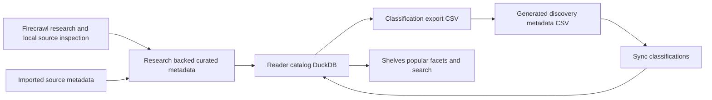
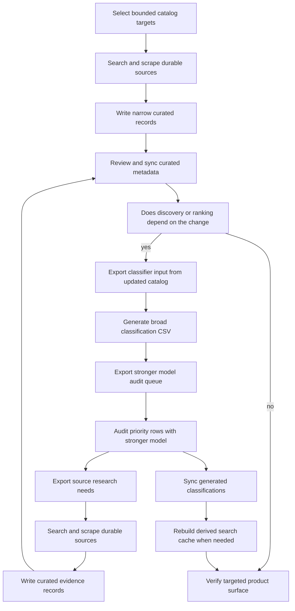

# Reader Metadata Enrichment Loop

LangNet reader metadata has two different evidence standards. Keep them
separate.

1. **Research-backed curated metadata** records facts or claims we can cite:
   display corrections, aliases, attribution claims, contained-work boundaries,
   work maps, citation maps, search concepts, and source metadata.
2. **Generated discovery metadata** records interpretive catalog judgments:
   discovery group, tags, popularity scores, popularity tiers, author bios, and
   short classification notes.

An OpenRouter or other LLM call may generate useful prose such as an author bio
for Vyāsa, but the claim that a work is attributed to Vyāsa should come from a
curated evidence layer when the source data is ambiguous. Likewise, the
Bhagavadgītā's reader boundary inside the Mahābhārata is a contained-work or
work-map fact; its Religion shelf placement and popularity score are generated
discovery metadata.

## Data Layers

| Layer | Purpose | Current storage | Entry points |
| --- | --- | --- | --- |
| Imported source metadata | Facts already present in local source catalogs or headers | `source_metadata` table | reader build and source-enrichment code in `src/langnet/reader/builder.py` and `src/langnet/reader/source_enrichment.py` |
| Curated display overlays | Evidence-backed corrections to displayed `author`, `author_id`, `title`, `language`, or `cts_work_urn` | `data/curated/reader_metadata` then catalog overlay tables | `reader overlay-review`, `reader sync-metadata-overlays` |
| Curated attribution claims | Evidence-backed responsibility claims that may not change display metadata | `data/curated/reader_attributions` then `metadata_attributions` | `reader sync-metadata-attributions`, `reader attributions` |
| Curated aliases | Alternate titles, abbreviations, and search-facing names | `data/curated/reader_aliases` | reader build |
| Curated contained works | Embedded works with source-backed identity and citation ranges | `data/curated/reader_contained_works` then `contained_works` | reader build |
| Curated work maps | Table-of-contents and citation-range structure | `data/curated/reader_work_maps` | reader build |
| Curated citation maps | Source/work-specific mappings from scholarly or dictionary citation conventions to local machine citation shapes | `data/curated/reader_citation_maps` then `citation_maps` | reader build, `reader sync-citation-maps`, `reader citation-maps` |
| Curated search concepts | Query expansions and concept labels | `data/curated/reader_search` | `reader search-index build` |
| Generated work classifications | Discovery group, tags, popularity, category, period, and notes | CSV under `data/generated/reader_classifications`, then `work_classifications` | `reader classification-export`, `reader classify-works`, `reader sync-classifications` |
| Generated author classifications | Author bio, historicity, period, region, prominence | CSV under `data/generated/reader_classifications`, then author classification tables | `reader author-classification-export`, `reader classify-authors`, `reader sync-author-classifications` |
| Derived search cache | Search index over catalog and curated search concepts | `data/build/reader/search.lance` | `reader search-index build`, `reader search-index validate` |

## Boundary Rules

- Do not use generated classification CSVs as evidence for identity, authorship,
  or citation boundaries.
- Do not put Firecrawl scratch paths into curated YAML. Cite the original URL or
  stable source identifier.
- Do not promote an attribution into display metadata unless the display claim is
  clear. Use an attribution claim when traditions compete or certainty is lower.
- Do not let generated author bios imply uncited authorship facts. Generated bios
  can summarize a known agent after the agent identity has been established by
  source or curated metadata.
- Do not let generated discovery groups erase cross-domain tags. A primary shelf
  group is one route into the catalog; tags preserve secondary routes.
- After changing curated facts that classification relies on, regenerate or
  resync the generated layer before declaring shelves, popular lists, facets, or
  author prominence ready.

## Generation Scope And Profiles

Keep two axes distinct:

- **Output profile:** `slim` asks the model only for discovery group, tags,
  popularity, period, authorship status, confidence, and notes. The importer
  derives compatibility columns such as category, scope, and legacy popularity
  fields locally. This is the recommended default because smaller requested
  output is easier to keep consistent.
- **Run scope:** a full-language pass covers the whole exported language CSV and
  is appropriate when taxonomy, prompt policy, or broad catalog evidence changes.
  A partial or incremental pass covers a bounded queue and is appropriate for
  high-impact audit improvements, local corrections, or follow-up review after a
  broad pass.

Use the `full` output profile only when intentionally testing or migrating the
model-written compatibility columns themselves. Use partial incremental CSVs for
quality ratchets: they should be tracked, merged after the broad generated CSV,
and ordered before explicit reviewed audit corrections.

Target partial audit queues with `classification-escalation-export`. The default
priority rule selects rows with canonical/high global popularity, high
within-group popularity, or low confidence. That gives the stronger model the
rows where mistakes are most visible or most likely, without making every broad
classification pass slow and expensive.

Target source-backed research with `research-needs-export`. This queue reads a
generated classification CSV and the current catalog, then emits uncovered
research needs such as attribution, contained-work, work-map, or source-context
gaps. Accepted curated coverage suppresses repeat work for the same need type,
so the queue does not simply recycle the same popular works forever. The CLI
defaults to `--per-need-type-limit 5`, which keeps attribution debt from
burying work-map, contained-work, and source-context candidates.
Generated rows are resolved against the current catalog before they enter the
research queue, including known CTS identifier-shape differences such as
`tlg0086.034` and `tlg0086.tlg034`. The default queue should therefore contain
only real current source texts. If an old generated row cannot be resolved, use
`--include-unresolved` to emit it as `catalog_identity_needed` maintenance
rather than as a Firecrawl research target.

Author bios are currently generated author-classification metadata. Work-level
reader prose currently lives in generated classification notes. Source-backed
author or work biography should enter through curated/source-backed layers
first, such as attribution claims, source metadata, aliases, or future dedicated
bio/source-context records. For Greek authors, Suda-style biographical evidence
is an ideal research target when it can be tied to the catalog identity.

## Diagrams

The layer boundary is the main invariant:



The operational loop has two explicit sync passes:



## Standard Loop

Use this path for a Firecrawl-backed metadata batch.

1. **Select bounded targets from the catalog.**
   ```bash
   export CATALOG=data/build/reader/catalog.duckdb
   export BATCH=reader-metadata-batch
   just cli reader --catalog "$CATALOG" works --language san --author Unknown --output json
   just cli reader --catalog "$CATALOG" work <work-id-or-source-id> --output json
   just cli reader --catalog "$CATALOG" contents <work-id-or-source-id> --limit 12 --output json
   ```

2. **Collect research evidence.**
   Store Firecrawl search and scrape artifacts under
   `.firecrawl/reader-metadata/<batch>/`. These files are audit scratch, not
   runtime data.

3. **Write the narrowest curated record.**
   Use display overlays for display fields, attribution YAML for responsibility
   claims, aliases for alternate names, contained works for embedded works,
   work maps for work table-of-contents structures, citation maps for
   source-specific scholarly-reference quirks, and source metadata for
   source-backed context that should inform classification without mutating
   display fields.

4. **Review and sync curated records.**
   ```bash
   just cli reader overlay-review \
     --metadata-overlay-dir data/curated/reader_metadata \
     --reviewer rule
   just cli reader --catalog "$CATALOG" sync-metadata-overlays --output json
   just cli reader --catalog "$CATALOG" sync-metadata-attributions --output json
   ```

5. **Regenerate or restore generated discovery metadata when needed.**
   Generated work classification export includes catalog fields and
   `source_metadata_summary`; the classifier prompt treats that summary as
   source-backed context, but the output remains generated metadata. The
   default generator request uses a slim output profile and a fixed stratified
   shuffle seed so each model batch mixes catalog clusters such as many works
   by one author, while the final CSV is written back in input order.
   ```bash
   just cli reader --catalog "$CATALOG" classification-export \
     --language san \
     --path "examples/debug/$BATCH/sanskrit-discovery-input.csv"

   just cli reader classify-works \
     --input-csv "examples/debug/$BATCH/sanskrit-discovery-input.csv" \
     --output-csv "examples/debug/$BATCH/sanskrit-generated-discovery.csv" \
     --model openai:deepseek/deepseek-v4-flash \
     --output-profile slim \
     --batch-order stratified \
     --shuffle-seed langnet-reader-classification-v1 \
     --output json

   just cli reader classification-escalation-export \
     --input-csv "examples/debug/$BATCH/sanskrit-generated-discovery.csv" \
     --path "examples/debug/$BATCH/sanskrit-pro-audit-input.csv" \
     --output json

   export PRO_CLASSIFICATION_MODEL="openai:deepseek/deepseek-v4-pro"
   just cli reader classify-works \
     --input-csv "examples/debug/$BATCH/sanskrit-pro-audit-input.csv" \
     --output-csv "examples/debug/$BATCH/sanskrit-pro-audit-generated.csv" \
     --model "$PRO_CLASSIFICATION_MODEL" \
     --run-id reader-classifier-batch-pro-audit \
     --output-profile slim \
     --batch-order stratified \
     --shuffle-seed langnet-reader-classification-v1 \
     --output json

   just cli reader --catalog "$CATALOG" sync-classifications \
     --classification-csv "examples/debug/$BATCH/sanskrit-generated-discovery.csv" \
     --merge \
     --output json
   just cli reader --catalog "$CATALOG" sync-classifications \
     --classification-csv "examples/debug/$BATCH/sanskrit-pro-audit-generated.csv" \
     --merge \
     --output json

   just cli reader --catalog "$CATALOG" research-needs-export \
     --classification-csv "examples/debug/$BATCH/sanskrit-pro-audit-generated.csv" \
     --path "examples/debug/$BATCH/research-needs.csv" \
     --per-need-type-limit 5 \
     --output json
   ```

6. **Apply audit corrections as generated-metadata overrides.**
   Use audit correction CSVs when a generated category, shelf group, tag set, or
   popularity score is wrong but the underlying work identity is already known.
   ```bash
   just cli reader --catalog "$CATALOG" sync-classifications \
     --classification-csv data/generated/reader_classifications/2026-05-17/discovery/audit-corrections-2026-05-17.csv \
     --merge \
     --output json
   just cli reader --catalog "$CATALOG" prune-stale-classifications --output json
   ```

7. **Refresh derived caches when catalog-facing search can change.**
   ```bash
   just cli reader --catalog "$CATALOG" search-index build \
     --index data/build/reader/search.lance \
     --replace \
     --output json
   just cli reader --catalog "$CATALOG" search-index validate \
     --index data/build/reader/search.lance \
     --output json
   ```

8. **Verify the product surface that motivated the batch.**
   ```bash
   just cli reader --catalog "$CATALOG" popular \
     --language san \
     --group religion \
     --limit 20 \
     --output json
   just cli reader --catalog "$CATALOG" shelves \
     --language san \
     --sample-limit 10 \
     --output json
   just test test_reader_metadata_overlay test_reader_metadata_attribution test_reader_storage test_reader_cli
   ```

## Example: Bhagavadgītā On The Religion Shelf

The Bhagavadgītā case crosses both layers.

- The existence of a reader-facing Bhagavadgītā inside the Mahābhārata is a
  contained-work fact. It belongs in curated contained-work data with source,
  parent work, start citation, end citation, confidence, note, and evidence.
- The claim that this contained work should be primary-shelved under Religion is
  generated discovery metadata. An audit correction can set
  `classification_discovery_group_id=religion` while keeping tags such as
  `vedanta`, `bhakti`, `itihasa`, `mahabharata`, and `epic`.
- The shelf and popular commands read the synced `work_classifications` table.
  Therefore a catalog can contain the Bhagavadgītā and still omit it from the
  Religion shelf if generated classifications were not synced, did not resolve
  contained-work IDs, or classified the work under another primary group.

## Verification Expectations

A completed enrichment batch should report:

- target count and target selection command;
- Firecrawl searches and scrapes used;
- curated files added or changed, with status and confidence;
- generated CSVs regenerated or restored, if any;
- catalog sync commands and JSON summaries;
- search-index rebuild status when applicable;
- final product checks, such as `reader popular`, `reader shelves`,
  `reader search`, or `reader attributions`.
