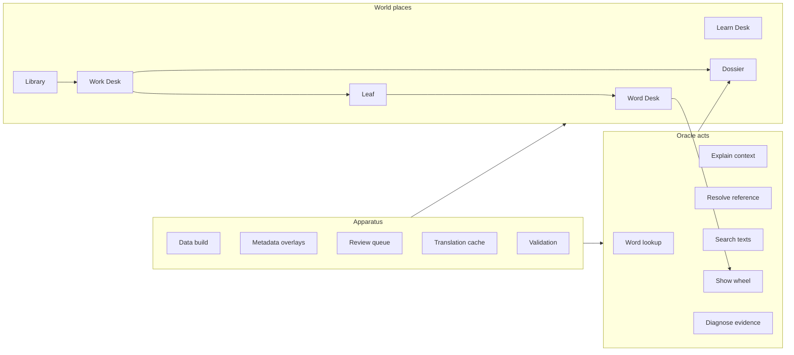
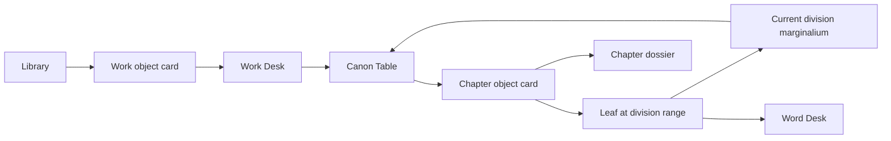
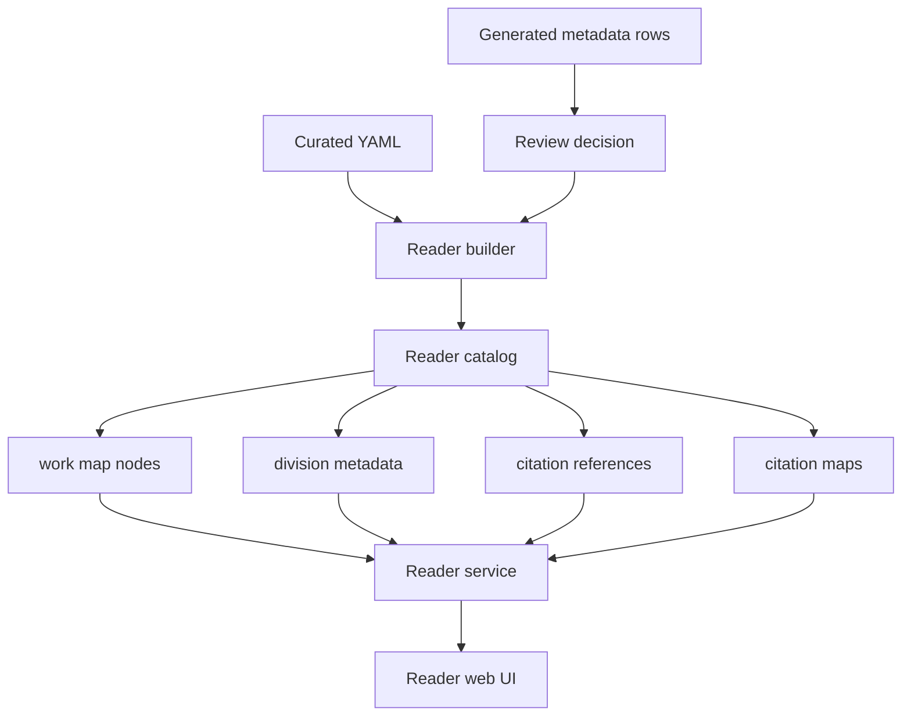

# Project Orion Reader Structure Design

Generated: 2026-06-02

## Purpose

Project Orion needs a coherent UI system for navigating and consulting
classical-language knowledge: words, works, authors, passages, chapters,
evidence, and generated study aids. The traditional text division feature is
the first concrete proving ground for that broader overhaul.

Within that overhaul, Orion needs a reliable way to index, address, display,
and research traditional text divisions: books, chapters, sections, verses,
sutras, and other conventional structures that do not always match the machine
layout of a local corpus.

The motivating examples are references such as `BhG 9.2`, `Yoga Sutra 1.3`,
`Republic Book 3`, Bible-style chapter and verse references, and dictionary
citations whose conventional forms do not match local segment IDs. The product
must help readers move between the arbitrary machine address and the
traditional address used by teachers, scholars, dictionaries, and source
traditions.

This design records the UI system that should govern the product. The
chapter/book work is the first concrete slice of the broader Project Orion UI
overhaul, but the product goal is the overhaul itself: a computable manuscript
workspace whose surfaces are consistent across dictionary lookup, library
navigation, work study, passage reading, learning, oracle consultation, and
research-backed metadata.

## Context

The current reader already has several adjacent pieces:

- `work_map_nodes` stores table-of-contents style ranges for works such as the
  Bhagavadgita.
- `citation_references` resolves compact external references to one or more
  reader segments.
- `citation_maps` stores source-specific projection rules, such as a
  three-part dictionary citation mapping to a two-part local machine citation.
- `/reader` provides library discovery, author browsing, text search, selected
  passage windows, a right sidebar, selected-word assistance, and URL-backed
  reader state.
- `uiCopy` centralizes some web copy through `i18next`, but many reader labels
  still live directly in the Svelte route.

The gap is not only data. The UI currently treats "Book contents" mostly as a
machine segment window. The new feature should make traditional structure a
first-class object in the reader experience.

## Goals

- Establish a practical Project Orion UI design system that can guide future
  Word, Library, Work, Leaf, Learn, Oracle, and Dossier work.
- Convert current ad hoc reader and dictionary surfaces into reusable UI
  primitives where possible.
- Improve mobile and tablet behavior through apparatus sheets or rails instead
  of simply stacking desktop sidebars below the main content.
- Make traditional divisions indexable, addressable, displayable, and
  provenance-bearing.
- Preserve the distinction between machine citation paths and traditional
  references.
- Show a selected work as a study object before and alongside close passage
  reading.
- Show chapter/book context while reading a passage.
- Support curated, source-backed, and LLM-generated division metadata with
  clear provenance markers.
- Support Firecrawl-backed research batches that produce durable curated YAML,
  generated metadata queues, and explicit evidence artifacts.
- Improve mobile access to structure, word help, evidence, and oracle-style
  consultation without pushing all sidebar content below the text.
- Establish reusable Project Orion UI primitives so later Word, Work, Author,
  Chapter, Passage, and Learn surfaces feel coherent.

## Non-Goals

- Do not replace the existing CLI JSON contracts with a browser-only API.
- Do not collapse all source traditions into one citation scheme.
- Do not hide generated material. Generated text may blend visually with the
  manuscript style, but it must carry provenance.
- Do not build all dossier routes before the first structure feature ships.
- Do not use visual ornament in a way that obscures controls, addresses, or
  evidence.

## Design Lineage

Project Orion is an orienting instrument for classical-language study. The UI
should feel like a computable manuscript desk: scholarly, didactic, immersive,
and source-aware.

- Orion of Thebes gives the project its philological orientation: names, forms,
  citations, and witnesses are sacred working material.
- Eusebius gives the canon table: structure, concordance, witness alignment,
  and cross-reference are not decoration.
- Ramon Llull gives the wheel: when relations multiply, the interface should
  offer combinatory instruments.
- Giordano Bruno gives the memory theater: repeated ideas should have spatial
  anchors and mnemonic marks.
- Albertus Magnus gives the scholastic apparatus: divisions, authorities,
  objections, definitions, and evidence remain inspectable.
- Cornelius Agrippa gives correspondence: word, root, passage, chapter, work,
  author, tradition, and source are navigable relations.
- Paracelsus gives diagnosis: the system reads signs, reports causes, and marks
  uncertainty.
- Comenius gives the didactic gate: a beginner should be invited into ordered
  learning rather than dropped into raw apparatus.
- Robert Burton gives the anatomy: deep views may be abundant and digressive,
  provided they are divided and cross-linked.
- Umberto Eco and the monastic library tradition give the product its room,
  shelf, desk, and inner-book metaphor.

## World And Oracle

The UI has two conceptual layers.

**World:** places the user can navigate. These include the Word Desk, Library,
Work Desk, Leaf, Learn Desk, and Dossiers.

**Oracle:** consultative acts performed from a place. These include lookup,
explanation, diagnosis, reference resolution, text search, semantic search,
generation, and evidence inspection.

The user should always know whether they are standing somewhere or consulting
something.

## Feature Taxonomy

Every feature should have one primary role.

- If it answers "where am I?", it belongs to the World.
- If it answers "what does this mean?", it belongs to the Oracle.
- If it answers "how was this produced or maintained?", it belongs to the
  Apparatus.

Current product surfaces classify as follows:

| Surface | Primary role | Design home |
| --- | --- | --- |
| Dictionary encounter | World | Word Desk |
| Word index and lexical wheel | World and Oracle | Word Desk, Wheel |
| MOTD learner folio | Oracle | Marginalium |
| Reader shelves | World | Library |
| Reader author index | World | Library |
| Reader text search | Oracle | Library, Work Desk |
| Reader contents and show | World | Leaf |
| Reader address resolution | Oracle | Reference consultation |
| Learn and Foster bridge | World and Oracle | Learn Desk |
| Encounter briefing | Oracle | Marginalium, Oracle Panel |
| Translation cache | Apparatus | Operator tools |
| Reader metadata overlays | Apparatus | Review and sync tools |
| Reader work maps | World and Apparatus | Canon Table data |
| Reader citation maps | Apparatus and Oracle | Reference projection |

For the traditional-division feature:

- World: structure map, current chapter, book and chapter addressability.
- Dossier: chapter page, work structure details, author/work/chapter bios.
- Oracle: explain this chapter, show themes, show related words, diagnose
  citation mapping.
- Apparatus: curated maps, generated overlays, review workflow, validation.

## UI Primitives

The overhaul should standardize these primitives.

### Object Card

A compact summary for a Word, Work, Author, Chapter, or Passage. It contains:

- type mark;
- title and native title;
- address or reference;
- short description;
- provenance chip row;
- primary actions.

### Dossier

A deep study view for a first-class object. It uses Burton-style divisions:
summary, names, structure, witnesses, evidence, related objects, and oracle
consultations.

### Leaf

The close-reading text surface. It is spacious, source-native, token-selectable,
and oriented by current work and current division.

### Marginalium

Compact contextual note beside the current object. Examples: selected word,
current chapter, source witness, citation map, grammar hint, or caveat.

### Canon Table

The default structure component for books, chapters, sections, witnesses,
parallel references, and author sections. It is not a plain list. It shows
hierarchy, ranges, labels, addresses, provenance, and actions.

### Wheel

A visual or structured neighborhood for lexical, semantic, grammatical,
mnemonic, or source-relation exploration. The current word wheel is the first
instance. A semantic wheel is a later instance.

### Oracle Panel

A consultative surface. It appears in three depths:

- quick answer in Marginalium;
- drawer or sheet for active inquiry;
- Dossier for durable deep study.

### Provenance Chip Row

A flat, always-visible row of provenance markers on claim-bearing blocks.
Examples: `Curated`, `Source`, `DCS`, `Perseus`, `LLM draft`, `Reviewed`,
`Needs evidence`.

Clicking a chip may expand a shallow evidence row inline. Full audit views are
secondary.

## Responsive Apparatus

Desktop, tablet, and mobile should preserve the same conceptual hierarchy but
not use the same cramped layout.

- Desktop: main World surface plus sticky right apparatus.
- Tablet: main World surface plus collapsible apparatus rail or inline object
  panels.
- Mobile: single-column World plus persistent apparatus actions that open
  sheets. Sidebar material should not be pushed below the entire text.

```mermaid
flowchart TB
    subgraph Desktop["Desktop desk"]
        DMain["Main world surface"]
        DSide["Sticky marginalia"]
        DDrawer["Oracle drawer"]
    end

    subgraph Tablet["Tablet desk"]
        TMain["Main world surface"]
        TRail["Collapsible apparatus rail"]
        TInline["Inline object panels"]
    end

    subgraph Mobile["Mobile leaf"]
        MMain["Single column world"]
        MTabs["Apparatus tabs"]
        MSheet["Bottom apparatus sheet"]
    end

    DMain --> DSide
    DSide --> DDrawer
    TMain --> TRail
    TRail --> TInline
    MMain --> MTabs
    MTabs --> MSheet
```

For mobile reader work, introduce an Apparatus Sheet with actions such as
`Structure`, `Word`, `Oracle`, and `Evidence`.

## Async State Rule

Every async operation uses one consistent loading pattern based on whether the
UI is creating new content or refreshing existing content.

- New content entering the page uses a skeleton shaped like the final content.
- Existing content being refreshed stays visible and receives one loading
  strip, pulsing badge, or spinner badge.
- Use one primary indicator per region.
- Show elapsed seconds for calls that may exceed about one second.
- Never blank stable scholarly context during async work.

Component names:

- Skeleton Manuscript Row;
- Loading Strip;
- Pulsing Provenance Badge;
- Elapsed Time Mark.

For this feature, the first Canon Table load uses skeleton chapter rows.
Regenerating a chapter bio keeps the chapter card visible and adds a single
`Researching 8s` style badge.

## Traditional Division UX

A selected work gains a Work Desk before or alongside the Leaf. The Work Desk
answers:

- What is this work?
- Who is attached to it?
- How is it structured?
- What witnesses or source layouts underlie it?
- Where can I start reading?
- What chapters, books, or divisions matter in the tradition?

The main structural component is the Canon Table. It displays accepted
traditional divisions as nested Object Cards:

- kind such as book, chapter, section, verse, sutra, pada;
- ordinal;
- localized label;
- native label when available;
- traditional reference;
- machine citation range;
- short bio or teaching note when available;
- provenance chips;
- actions such as open, open leaf, study division, ask oracle.

While reading a Leaf, the current division appears as Marginalium:

- current work;
- current book or chapter;
- current traditional address;
- compact provenance;
- structure action to open the Canon Table.

On mobile, Structure opens in the Apparatus Sheet.

## Data Architecture

Keep the existing concepts distinct.

- `work_map_nodes`: structure and display ranges.
- `citation_references`: exact external references resolving to one or more
  reader segments.
- `citation_maps`: source-specific projection rules between citation
  conventions.
- Future division metadata overlay: bios, alternate labels, traditional
  citation labels, generated/reviewed state, and evidence.

Prefer extending `work_map_nodes` through a companion table keyed by
`work_id + node_id` when the added material is not necessary for range
navigation. This keeps structure lookup lightweight and lets generated/reviewed
metadata evolve without overloading the core map row.

## Service Contracts

The first implementation should preserve existing behavior and add structure
gradually.

Recommended payload direction:

- `reader map` continues to return accepted map nodes, enriched where possible.
- Add or evolve a `reader structure` mode when the UI needs a contract richer
  than the current map payload.
- `reader work` includes a structure summary such as node count, top-level
  kinds, and whether bios are available.
- `reader show` and `reader contents` include current division context when
  available.
- `/api/reader` exposes the same modes and keeps MessagePack or JSON behavior.

Older catalogs without new tables must degrade to current contents behavior.

## Localization

User-facing names belong in `webapp/src/lib/ui-copy.ts`.

Terms such as Library, Word Desk, Work Desk, Leaf, Marginalium, Canon Table,
Wheel, Oracle, Dossier, Structure, and Evidence should be copy-layer values,
not hardcoded labels inside route files.

The UI may use poetic names, but the copy layer controls them so labels can be
changed without rewriting components.

## Error And Empty States

- Missing structure: show "No accepted structure map yet" rather than a blank
  list.
- Candidate structure: show it only when the view supports review or when
  clearly marked as `Needs review`.
- Generated bio: mark as `LLM draft` until reviewed.
- Citation mismatch: show traditional citation and machine citation separately.
- Failed research or generation: keep current content visible, show one
  replacing-region indicator or error strip.
- Unsupported source convention: show the unresolved reference and suggested
  evidence gap.

## Verification Strategy

Backend checks:

- loader tests for richer division metadata;
- storage tests for old-catalog compatibility;
- service tests for structure payloads and current-division context;
- CLI JSON contract tests.

Frontend checks:

- type mapping for Object Card, Canon Table, provenance chips, and Apparatus
  Sheet;
- desktop reader with structure sidebar;
- mobile reader with Apparatus Sheet;
- elapsed timer for long loads;
- empty/no-structure work;
- chapter card with bio and provenance;
- selected passage showing current chapter marginalia.

Before claiming implementation complete, run targeted Python tests and web
verification for the touched surface. For browser UI changes, verify desktop
and mobile screenshots and check that loading states do not overlap or blank
stable context.

## Implementation Slices

This is not the final implementation plan. It records likely slices for the
future plan.

1. Add Project Orion design vocabulary, localization keys, provenance chips,
   object cards, shared async indicators, and apparatus sheet primitives.
2. Rework the Reader route around the World and Oracle model without changing
   backend contracts: Library, Work Desk, Leaf, Marginalia, and mobile
   Apparatus Sheet.
3. Add frontend types for structure nodes, division metadata, provenance chips,
   and current division context.
4. Enrich `reader map` or add `reader structure` with UI-ready Canon Table data.
5. Add Work Desk structure module on desktop using current `work_map_nodes`.
6. Replace the sidebar "Book contents" with Structure Marginalium plus fallback
   segment contents.
7. Add mobile Apparatus Sheet with Structure, Word, Oracle, and Evidence panels.
8. Add division metadata overlay loading and sync.
9. Add chapter Object Cards with bios and provenance chips.
10. Add current-division context to `show` and `contents`.
11. Add Firecrawl-backed research workflow for source-backed work, author, and
    chapter context.
12. Add generated/reviewed work and chapter bio queues that feed the same
    provenance-bearing UI.

## Implementation Defaults

Use these defaults unless the implementation plan discovers a concrete reason
to revise them.

- Add a new `reader structure` mode for UI-ready Canon Table data while keeping
  `reader map` backward-compatible.
- Add the companion division metadata table in the first backend slice, but let
  the first UI slice render correctly when no bios are present.
- Use a bottom Apparatus Sheet as the first mobile pattern.
- Use the existing Bhagavadgita work map as the first real fixture target, plus
  small synthetic Greek, Latin, and Sanskrit storage fixtures for edge cases.
- Treat generated chapter and work bios as reviewable overlay rows, not as
  accepted display metadata, until an explicit review decision marks them
  accepted.
