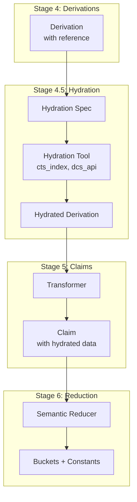

# Hydration vs Reduction

**Status**: Draft
**Date**: 2026-02-15
**Priority**: FOUNDATIONAL
**Related**: `tool-response-pipeline.md`, `query-planning.md`

## The Distinction

| Operation | Direction | Example |
|-----------|-----------|---------|
| **Hydration** | Expand | CTS URN → full citation text |
| **Reduction** | Condense | 10 glosses → 3 buckets |

These are **opposite** operations and must not be conflated.

## Current Problem

Diogenes hydrates CTS URNs inline:

```python
# Current: Diogenes does both extraction AND hydration
def handle_references(self, soup):
    refs = {}
    for ref in soup.select(".origjump"):
        ref_id = ref.attrs.get("class")[1]  # e.g., "urn:cts:latinLit:..."
        ref_txt = ref.get_text()            # Citation text (hydrated!)
        refs[ref_id] = ref_txt              # Both stored together
    return refs
```

**Problems**:
1. CTS URN and citation text are conflated
2. Can't re-hydrate without re-fetching Diogenes
3. Hydration logic is buried in adapter
4. Other tools can't share the CTS index

## The Right Architecture

### Stage 4.5: Hydration (Optional)

After Derivations, before Claims:

```
Derivations → [Hydration] → Claims → [Reduction] → Buckets
```

```python
@dataclass
class HydrationSpec:
    derivation_id: str
    reference_type: str          # "cts_urn", "dcs_ref", "dico_ref"
    reference_value: str         # "urn:cts:latinLit:phi0119.phi008"
    hydration_tool: str          # "cts_index", "dcs_api", "dico_db"

@dataclass
class HydratedDerivation:
    derivation_id: str
    original_derivation: Derivation
    hydrated_data: dict          # Citation text, author, work, etc.
    hydration_provenance: ProvenanceChain
```

### Hydration as a Tool

CTS URN Index follows the same tool pattern:

```
Hydration Call:
  tool: cts_index
  params: {urn: "urn:cts:latinLit:phi0119.phi008"}
  
Hydration Response:
  {
    "urn": "urn:cts:latinLit:phi0119.phi008",
    "text": "Arma virumque cano...",
    "author": "Vergil",
    "work": "Aeneid",
    "book": "1",
    "line": "1"
  }
```

### Example: Diogenes Entry

**Derivation (before hydration)**:
```python
Derivation(
    derivation_id="uuid-d003",
    derivation_type="DiogenesDictFact",
    derived_data={
        "entry_id": "00:01",
        "entry_text": "I. Lit.: ...",
        "citations": [
            {"urn": "urn:cts:latinLit:phi0119.phi008", "ref_text": "Verg. A. 1, 1"}
        ]
    }
)
```

**Hydration Call**:
```python
HydrationSpec(
    derivation_id="uuid-d003",
    reference_type="cts_urn",
    reference_value="urn:cts:latinLit:phi0119.phi008",
    hydration_tool="cts_index"
)
```

**Hydrated Derivation**:
```python
HydratedDerivation(
    derivation_id="uuid-d003",
    hydrated_data={
        "urn": "urn:cts:latinLit:phi0119.phi008",
        "text": "Arma virumque cano, Troiae qui primus ab oris...",
        "author": "Vergil",
        "work": "Aeneid",
        "book": "1",
        "line": "1",
        "translation": "I sing of arms and the man..."
    }
)
```

### Claim (after hydration):
```python
Claim(
    claim_id="uuid-c001",
    subject="lupus",
    predicate="has_citation",
    value={
        "cts_urn": "urn:cts:latinLit:phi0119.phi008",
        "text": "Arma virumque cano...",
        "author": "Vergil",
        "work": "Aeneid"
    }
)
```

## Hydration Sources

| Reference Type | Hydration Tool | Data Source |
|----------------|----------------|-------------|
| CTS URN | `cts_index` | Local DuckDB index |
| DCS Reference | `dcs_api` | DCS HTTP API |
| DICO Reference | `dico_db` | Local DICO database |
| MW Entry ID | `cdsl_index` | CDSL local cache |

## Hydration Control

Hydration is **optional** and **configurable**:

```python
class HydrationConfig:
    hydrate_citations: bool = True       # Expand CTS URNs
    hydrate_translations: bool = False   # Fetch translations
    hydrate_cross_refs: bool = False     # Follow cross-references
    max_hydration_depth: int = 1         # Prevent infinite loops
```

### View Modes

| View | Hydration | Reduction |
|------|-----------|-----------|
| **didactic** | Light (author/work only) | Heavy (bucketed) |
| **research** | Full (full text) | None (all facts) |

## Pipeline with Hydration



## Benefits

### 1. De-duplication

Same CTS URN appears in multiple entries. Hydrate once, share:

```
Diogenes entry for "lupus" → urn:cts:... → Hydrate → citation text
Diogenes entry for "lupa" → urn:cts:... → (cached) → same citation text
```

### 2. Re-hydration

Citation index updated? Re-hydrate without re-fetching tools:

```
Derivations (unchanged) → Re-hydrate → New citation data
```

### 3. Configurable Detail

```python
# Light hydration (fast)
hydrate_citations = {"author": True, "work": True, "text": False}

# Full hydration (slow)
hydrate_citations = {"author": True, "work": True, "text": True, "translation": True}
```

### 4. Provenance Preservation

The claim knows both:
- Where the URN came from (Diogenes derivation)
- Where the text came from (CTS index hydration)

```python
provenance_chain = {
    "derivation": {"tool": "diogenes", "extraction_id": "..."},
    "hydration": {"tool": "cts_index", "fetched_at": "..."}
}
```

## Implementation

### Hydration Service

```python
class HydrationService:
    def __init__(self, tools: dict[str, HydrationTool]):
        self.tools = tools
        self.cache = HydrationCache()
    
    def hydrate(self, spec: HydrationSpec) -> HydratedDerivation:
        # Check cache first
        cached = self.cache.get(spec.reference_value)
        if cached:
            return cached
        
        # Call hydration tool
        tool = self.tools[spec.hydration_tool]
        result = tool.fetch(spec.reference_value)
        
        # Cache and return
        hydrated = HydratedDerivation(
            derivation_id=spec.derivation_id,
            hydrated_data=result
        )
        self.cache.set(spec.reference_value, hydrated)
        return hydrated
```

### CTS Index as Hydration Tool

```python
class CTSIndexHydrator(HydrationTool):
    tool_name = "cts_index"
    
    def __init__(self, db_path: Path):
        self.db = duckdb.connect(str(db_path))
    
    def fetch(self, urn: str) -> dict:
        result = self.db.execute(
            "SELECT * FROM citations WHERE cts_urn = ?", [urn]
        ).fetchone()
        
        if result:
            return {
                "urn": urn,
                "text": result["text"],
                "author": result["author"],
                "work": result["work"],
                "book": result["book"],
                "line": result["line"]
            }
        return {"urn": urn, "error": "not_found"}
```

## Migration Path

### Phase 1: Separate Hydration from Diogenes

1. Diogenes emits CTS URN references only (no text)
2. Add hydration step after derivation
3. Compare output with current (should match)

### Phase 2: Build CTS Index Hydrator

1. Create `cts_index` hydration tool
2. Populate from existing data + Perseus
3. Wire into pipeline

### Phase 3: Add Other Hydrators

1. DCS API hydrator
2. DICO database hydrator
3. Cross-reference hydrator

## Related Documents

- `docs/technical/design/tool-response-pipeline.md` - Main pipeline stages
- `docs/technical/design/query-planning.md` - Query planning
- `src/langnet/citation/cts_urn.py` - Existing CTS URN code (reference)
