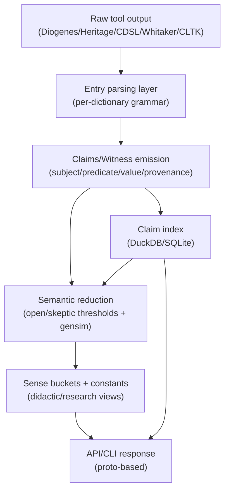
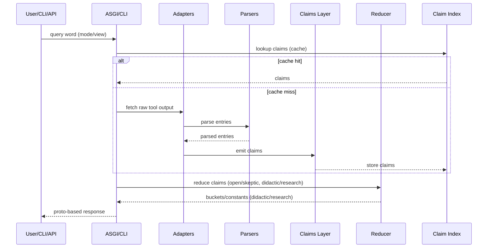

# Semantic Pipeline (Planned)

```mermaid
flowchart TD
  raw["Raw tool output\n(Diogenes/Heritage/CDSL/Whitaker/CLTK)"]
  parse["Entry parsing layer\n(per-dictionary grammar)"]
  claims["Claims/Witness emission\n(subject/predicate/value/provenance)"]
  reduce["Semantic reduction\n(open/skeptic thresholds + gensim)"]
  buckets["Sense buckets + constants\n(didactic/research views)"]
  index["Claim index\n(DuckDB/SQLite)"]
  api["API/CLI response\n(proto-based)"]

  raw --> parse --> claims --> reduce --> buckets --> api
  claims --> index
  index --> reduce
  index --> api
```

```mermaid
sequenceDiagram
  participant U as User/CLI/API
  participant A as ASGI/CLI
  participant AD as Adapters
  participant P as Parsers
  participant C as Claims Layer
  participant R as Reducer
  participant IDX as Claim Index

  U->>A: query word (mode/view)
  A->>IDX: lookup claims (cache)
  alt cache hit
    IDX-->>A: claims
  else cache miss
    A->>AD: fetch raw tool output
    AD->>P: parse entries
    P-->>AD: parsed entries
    AD->>C: emit claims
    C-->>IDX: store claims
  end
  A->>R: reduce claims (open/skeptic, didactic/research)
  R-->>A: buckets/constants (didactic/research)
  A-->>U: proto-based response
```
