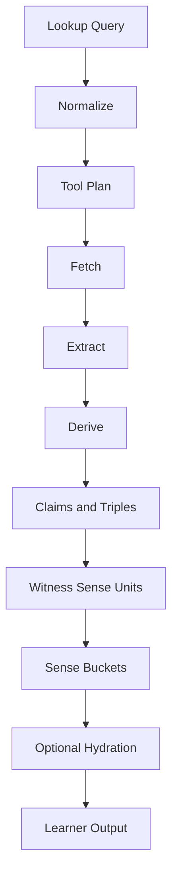

# Semantic Pipeline Diagram

```mermaid
flowchart TD
    A[Lookup Query] --> B[Normalize]
    B --> C[Tool Plan]
    C --> D[Fetch]
    D --> E[Extract]
    E --> F[Derive]
    F --> G[Claims and Triples]
    G --> H[Witness Sense Units]
    H --> I[Sense Buckets]
    I --> J[Optional Hydration]
    J --> K[Learner Output]
```

Implemented today: through `Claims and Triples`.

Next implementation target: `Witness Sense Units` and `Sense Buckets`.
