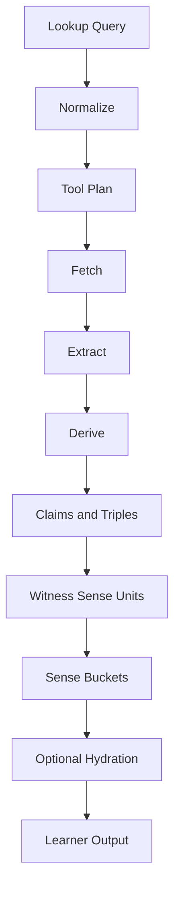

# Semantic Pipeline Diagram

Implemented today: through exact `Sense Buckets` and first `Learner Output`
via `langnet-cli encounter`.

Next implementation target: better learner display over the existing buckets:
reader-form ranking, compact glosses, and evidence-preserving source details.
