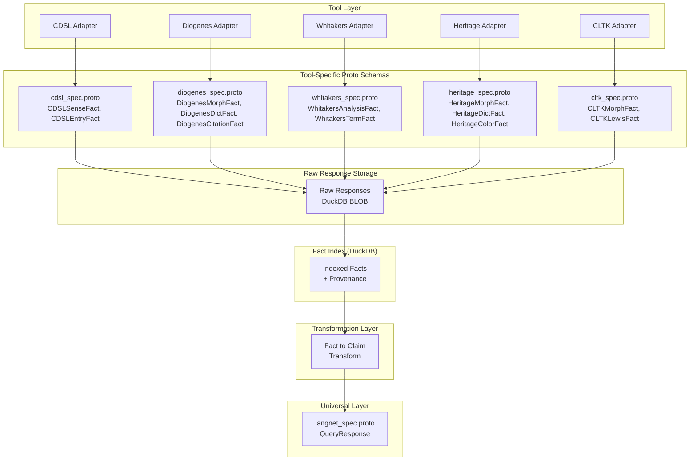
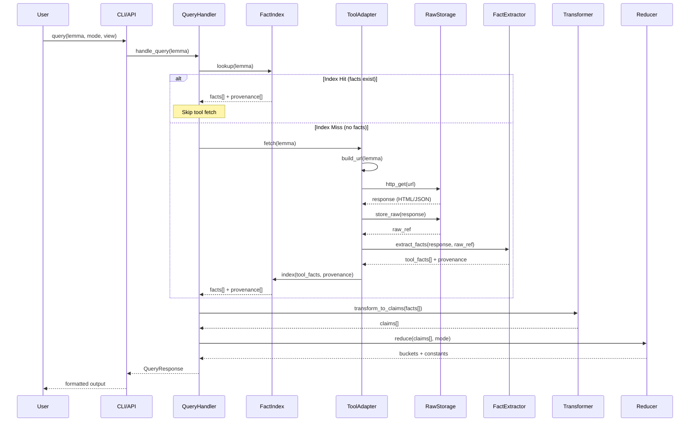
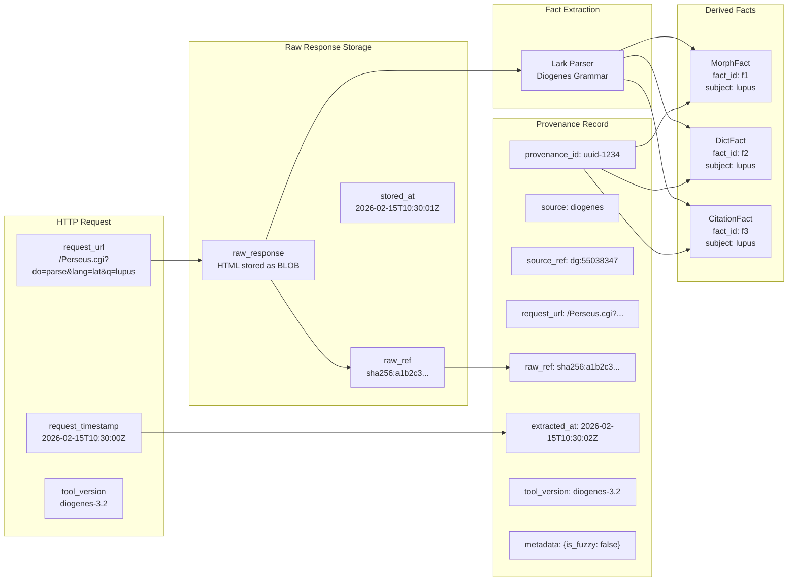
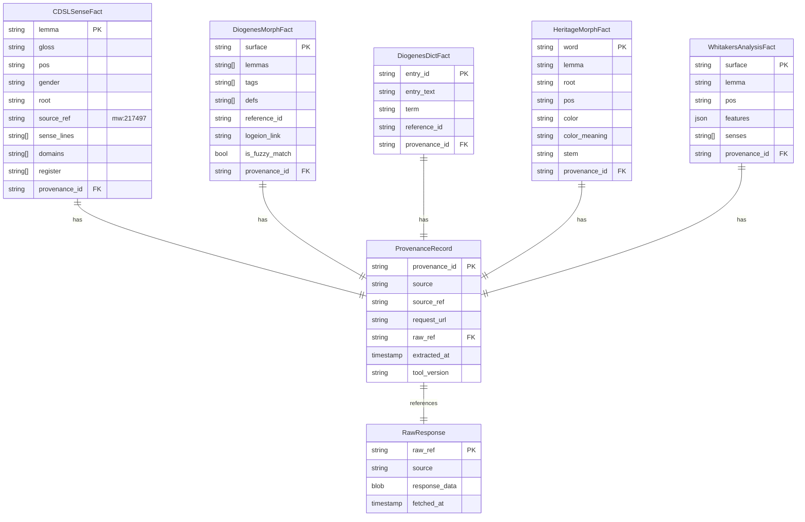
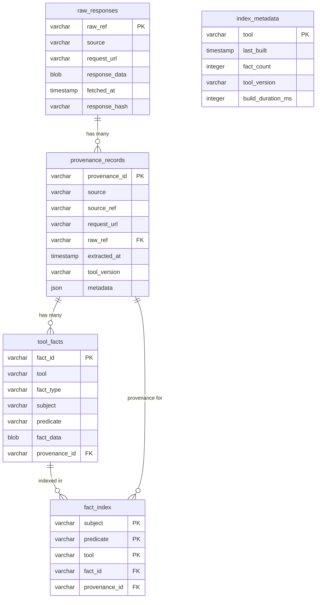
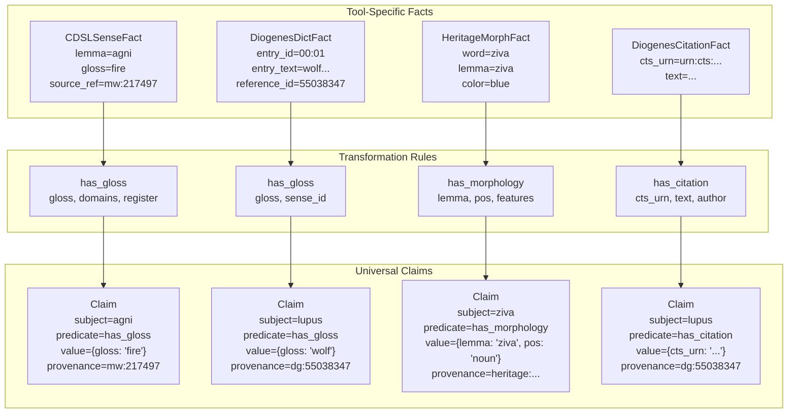
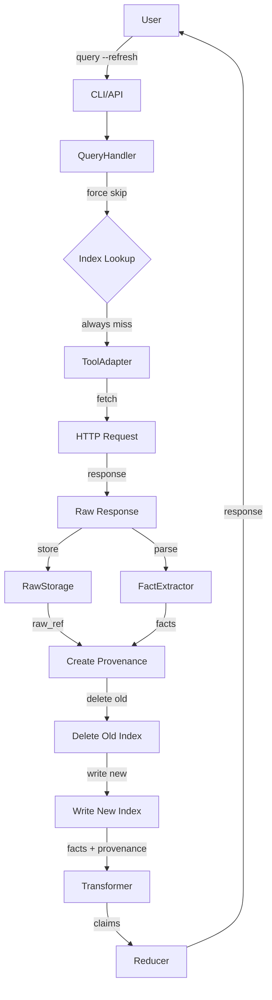
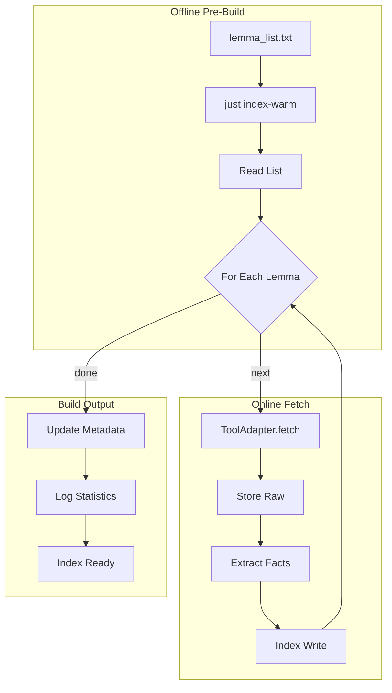
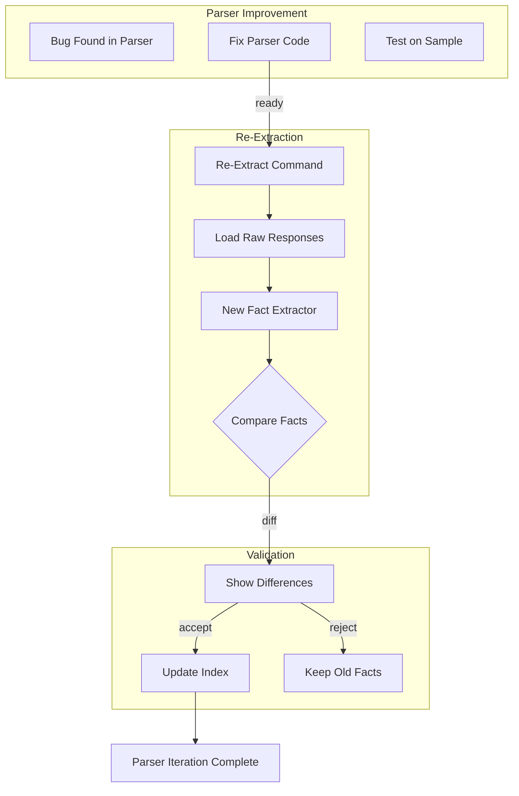
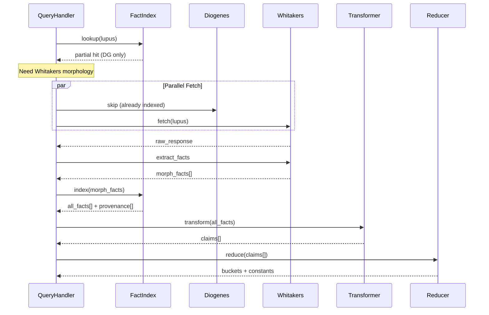

# Tool Fact Flow Diagrams

Mermaid diagrams for the tool fact extraction and indexing architecture.

## 1. Two-Layer Proto Architecture

## 2. Index-First Query Flow

## 3. Provenance Chain Detail

## 4. Tool Fact Types ER Diagram

## 5. Index Schema ER Diagram

## 6. Fact to Claim Transformation

## 7. Refresh Flow

## 8. Pre-Build (Warm) Flow

## 9. Parser Iteration Flow

One of the key benefits of storing raw responses is the ability to iterate on parsers without re-fetching:

## 10. Multi-Tool Query Flow

When a query requires multiple tools (e.g., Latin word needs both Diogenes and Whitakers):

