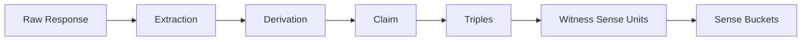

# Tool Fact Flow Diagram

```mermaid
flowchart LR
    R[Raw Response] --> X[Extraction]
    X --> D[Derivation]
    D --> C[Claim]
    C --> T[Triples]
    T --> W[Witness Sense Units]
    W --> B[Sense Buckets]
```

Evidence travels with every stage. Triple evidence belongs in `metadata.evidence`.
