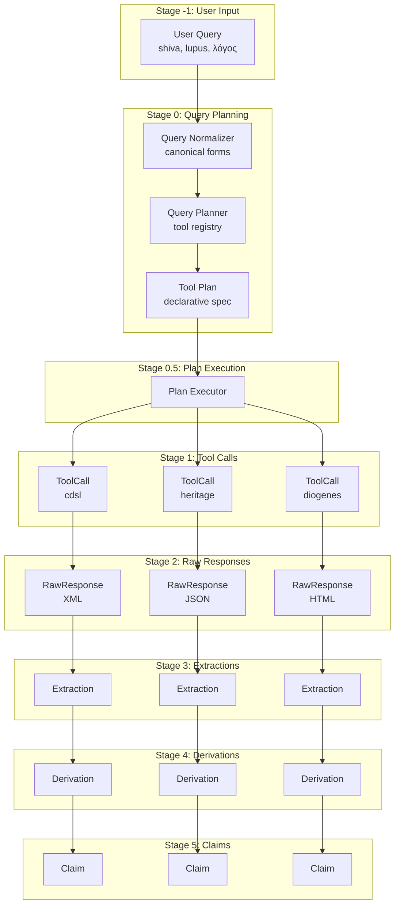

# Query Planning Architecture

**Status**: Draft
**Date**: 2026-02-15
**Priority**: FOUNDATIONAL
**Related**: `tool-response-pipeline.md`

## Executive Summary

Before any tool is called, a **Query Planner** determines:
1. What canonical form(s) to look up
2. Which tools to call
3. What parameters each tool needs

The **Tool Plan** is a declarative specification that can be:
- Inspected for debugging
- Cached for repeated queries
- Executed independently of planning

```
User Query → Query Normalizer → Query Planner → Tool Plan → Tool Executor → Pipeline...
```

## The Problem

Different tools require different query transformations:

| Tool | Query "shiva" | Required Form |
|------|---------------|---------------|
| CDSL | śiva | SLP1: "Siva" |
| Heritage | śiva | Velthuis: "ziva" |
| Diogenes (Latin) | lupus | ASCII: "lupus" |
| Diogenes (Greek) | λόγος | Betacode: "lo/gos" |
| Whitakers | lupus | ASCII: "lupus" |
| CTS URN Index | urn:cts:... | URN string |

Current code handles this ad-hoc within adapters. The Query Planner makes this explicit.

## Architecture

### Stage 0: Query Normalization

Transform user input to canonical form(s):

```python
@dataclass
class NormalizedQuery:
    original: str                    # "shiva"
    language: LanguageHint           # SAN, LAT, GRC
    canonical_forms: list[str]       # ["śiva", "Siva", "ziva"]
    normalizations: list[NormalizationStep]
    
@dataclass
class NormalizationStep:
    operation: str                   # "transliterate", "lowercase", "strip_diacritics"
    input: str                       # "shiva"
    output: str                      # "śiva"
    tool: str                        # "heritage_encoder", "iast_to_slp1"
```

**Examples**:

```
User: "shiva" (language=san)
→ NormalizedQuery:
    original: "shiva"
    canonical_forms: ["śiva"]  # IAST canonical
    normalizations: [
      {"operation": "transliterate", "input": "shiva", "output": "śiva", "tool": "velthuis_to_iast"}
    ]

User: "λόγος" (language=grc)
→ NormalizedQuery:
    original: "λόγος"
    canonical_forms: ["λόγος", "λογοσ"]  # With/without accents
    normalizations: [
      {"operation": "strip_accents", "input": "λόγος", "output": "λογοσ", "tool": "greek_normalizer"}
    ]

User: "agni" (language=san)
→ NormalizedQuery:
    original: "agni"
    canonical_forms: ["agni", "agní"]  # Try with/without accent
    normalizations: [...]
```

### Stage 0.5: Query Planning

Build a declarative plan for tool execution:

```python
@dataclass
class ToolPlan:
    plan_id: str                     # UUID
    query: NormalizedQuery
    tool_calls: list[ToolCallSpec]
    dependencies: list[tuple[str, str]]  # (tool_a, tool_b) if b depends on a
    created_at: datetime

@dataclass  
class ToolCallSpec:
    tool: str                        # "cdsl", "heritage", "diogenes", "cts_index"
    call_id: str                     # UUID (pre-assigned for tracing)
    endpoint: str                    # URL or method name
    params: dict                     # Tool-specific parameters
    expected_response_type: str      # "xml", "html", "json", "text"
    priority: int                    # Execution order hint
    optional: bool                   # If false, failure aborts plan
```

**Example Plan for "shiva" (Sanskrit)**:

```python
ToolPlan(
    plan_id="uuid-plan-001",
    query=NormalizedQuery(
        original="shiva",
        canonical_forms=["śiva"],
        language=LanguageHint.SAN
    ),
    tool_calls=[
        ToolCallSpec(
            tool="cdsl",
            call_id="uuid-call-001",
            endpoint="http://localhost:48080/sktreader",
            params={"q": "Siva"},  # SLP1 for CDSL
            expected_response_type="xml",
            priority=1,
            optional=False
        ),
        ToolCallSpec(
            tool="heritage",
            call_id="uuid-call-002", 
            endpoint="http://localhost:8080/morph",
            params={"q": "ziva"},  # Velthuis for Heritage
            expected_response_type="json",
            priority=1,
            optional=False
        ),
        ToolCallSpec(
            tool="cts_index",
            call_id="uuid-call-003",
            endpoint="local_duckdb",
            params={"lemma": "śiva", "language": "san"},
            expected_response_type="json",
            priority=2,  # After lexicon lookups
            optional=True
        )
    ],
    dependencies=[],  # All independent, can run in parallel
    created_at=datetime.now()
)
```

**Example Plan for "lupus" (Latin)**:

```python
ToolPlan(
    plan_id="uuid-plan-002",
    query=NormalizedQuery(
        original="lupus",
        canonical_forms=["lupus"],
        language=LanguageHint.LAT
    ),
    tool_calls=[
        ToolCallSpec(
            tool="diogenes",
            call_id="uuid-call-004",
            endpoint="http://localhost:8888/Perseus.cgi",
            params={"do": "parse", "lang": "lat", "q": "lupus"},
            expected_response_type="html",
            priority=1,
            optional=False
        ),
        ToolCallSpec(
            tool="whitakers",
            call_id="uuid-call-005",
            endpoint="local_binary",
            params={"word": "lupus"},
            expected_response_type="text",
            priority=1,
            optional=True  # Whitakers may not be installed
        ),
        ToolCallSpec(
            tool="cltk",
            call_id="uuid-call-006",
            endpoint="local_python",
            params={"word": "lupus", "language": "lat"},
            expected_response_type="json",
            priority=2,
            optional=True
        )
    ],
    dependencies=[],
    created_at=datetime.now()
)
```

### Stage 0.5: Plan Execution

Execute the plan, storing raw responses and yielding stable IDs:

```python
@dataclass
class ExecutedPlan:
    plan_id: str
    plan_hash: str                    # Hash of plan spec (for cache lookup)
    tool_response_ids: dict[str, str] # tool_name → response_id
    execution_time_ms: int
    from_cache: bool                  # True if all responses were cached

@dataclass
class ToolResponseRef:
    tool: str
    response_id: str                  # Stable ID (hash or UUID)
    cached: bool                      # True if from cache
```

**Key insight**: The executor only stores raw responses and yields IDs. It does NOT extract or derive. The processor takes those IDs and continues the pipeline.

### Plan Hashing and Cache Resolution

A ToolPlan can be resolved to cached response IDs without execution:

```python
class PlanExecutor:
    def execute(self, plan: ToolPlan) -> ExecutedPlan:
        # 1. Hash the plan for cache lookup
        plan_hash = self._hash_plan(plan)
        
        # 2. Check if all responses are already cached
        cached = self._lookup_cached_responses(plan_hash)
        if cached and not self._force_refresh:
            return ExecutedPlan(
                plan_id=plan.plan_id,
                plan_hash=plan_hash,
                tool_response_ids=cached,
                from_cache=True
            )
        
        # 3. Execute tool calls that aren't cached
        response_ids = {}
        for spec in plan.tool_calls:
            if spec.call_id in cached:
                response_ids[spec.tool] = cached[spec.call_id]
            else:
                response_id = self._execute_and_store(spec)
                response_ids[spec.tool] = response_id
        
        # 4. Cache the plan → response mapping
        self._cache_plan_responses(plan_hash, response_ids)
        
        return ExecutedPlan(
            plan_id=plan.plan_id,
            plan_hash=plan_hash,
            tool_response_ids=response_ids,
            from_cache=False
        )
```

### Plan → Response ID Resolution

The key invariant: **Same plan hash always resolves to same response IDs.**

```python
# First execution: fetch + store
plan = planner.plan("shiva", LanguageHint.SAN)
executed = executor.execute(plan)
# executed.tool_response_ids = {"cdsl": "resp-001", "heritage": "resp-002"}
# executed.from_cache = False

# Later, same query: cache hit
plan2 = planner.plan("shiva", LanguageHint.SAN)  # Same plan
executed2 = executor.execute(plan2)
# executed2.tool_response_ids = {"cdsl": "resp-001", "heritage": "resp-002"}  # SAME IDs
# executed2.from_cache = True
```

**Cache Table**:

```sql
CREATE TABLE plan_cache (
    plan_hash VARCHAR PRIMARY KEY,
    plan_id VARCHAR,
    tool_response_ids JSON,     -- {"cdsl": "resp-001", "heritage": "resp-002"}
    created_at TIMESTAMP,
    last_accessed TIMESTAMP
);
```

**Plan Hash** = deterministic hash of:
- Canonical query form
- Tool names + parameters
- Tool versions (for cache invalidation)

```python
def _hash_plan(self, plan: ToolPlan) -> str:
    content = f"{plan.query.canonical_forms[0]}"
    for call in sorted(plan.tool_calls, key=lambda c: c.tool):
        content += f"|{call.tool}:{call.params}"
    return hashlib.sha256(content.encode()).hexdigest()[:16]
```

### Executor and Processor are Fully Decoupled

```
┌─────────────────────────────────────────────────────────────────┐
│ PLAN EXECUTOR                                                   │
│                                                                 │
│  ToolPlan ──hash──► plan_hash ──lookup──► Cache? ──hit──► IDs   │
│                                    │                            │
│                                    └──miss──► Execute ──► IDs   │
│                                                                 │
│  Yields: ExecutedPlan { tool_response_ids: {...} }             │
└─────────────────────────────────────────────────────────────────┘
                              │
                              │ IDs only
                              ▼
┌─────────────────────────────────────────────────────────────────┐
│ RESPONSE PROCESSOR                                              │
│                                                                 │
│  response_ids ──lookup──► Derivations exist? ──yes──► Return   │
│                    │                                            │
│                    └──no──► Extract → Derive → Store → Return   │
│                                                                 │
│  Yields: list[Derivation]                                       │
└─────────────────────────────────────────────────────────────────┘
```

The processor never knows if responses were fresh or cached. It just gets IDs and continues.

### Query → Plan Cache (Layer 0)

Same pattern applies at the query level. A query string resolves to a cached plan:

```python
class QueryCache:
    def resolve_plan(self, query: str, language: LanguageHint) -> ToolPlan | None:
        query_hash = self._hash_query(query, language)
        cached = self.db.execute(
            "SELECT plan_id FROM query_cache WHERE query_hash = ?", 
            [query_hash]
        ).fetchone()
        
        if cached:
            return self._load_plan(cached["plan_id"])
        return None
    
    def store_plan(self, query: str, language: LanguageHint, plan: ToolPlan) -> None:
        query_hash = self._hash_query(query, language)
        self.db.execute(
            "INSERT INTO query_cache (query_hash, query, language, plan_id, plan_data) VALUES (?, ?, ?, ?, ?)",
            [query_hash, query, language.value, plan.plan_id, plan.to_json()]
        )
```

**Cache Table**:

```sql
CREATE TABLE query_cache (
    query_hash VARCHAR PRIMARY KEY,
    query VARCHAR NOT NULL,
    language VARCHAR NOT NULL,
    plan_id VARCHAR NOT NULL,
    plan_data JSON,              -- Full serialized plan
    created_at TIMESTAMP,
    last_accessed TIMESTAMP
);
```

### Complete Cache Chain

```
┌──────────────────────────────────────────────────────────────────────────┐
│ CACHE LAYER 0: Query → Plan                                              │
│                                                                          │
│  "shiva" + SAN ──hash──► query_hash ──lookup──► Cache?                  │
│                                                       │                  │
│                                  ┌────────────────────┴────────────┐     │
│                                  ▼                                  ▼     │
│                              HIT: return cached plan           MISS:     │
│                                                                  plan()   │
│                                                                    │      │
│                                                                    ▼      │
│                                                              store plan   │
└──────────────────────────────────────────────────────────────────────────┘
                                    │
                                    ▼
┌──────────────────────────────────────────────────────────────────────────┐
│ CACHE LAYER 1: Plan → Response IDs                                       │
│                                                                          │
│  ToolPlan ──hash──► plan_hash ──lookup──► Cache?                        │
│                                                   │                      │
│                              ┌──────────────────┴──────────────┐         │
│                              ▼                                 ▼         │
│                          HIT: return IDs                  MISS: execute  │
│                                                                store IDs │
└──────────────────────────────────────────────────────────────────────────┘
                                    │
                                    ▼
┌──────────────────────────────────────────────────────────────────────────┐
│ CACHE LAYER 2: Response ID → Derivations                                 │
│                                                                          │
│  response_id ──lookup──► Derivations exist?                             │
│                              │                                           │
│              ┌───────────────┴───────────────┐                          │
│              ▼                               ▼                           │
│          HIT: return derivations      MISS: extract + derive             │
│                                         store derivations                │
└──────────────────────────────────────────────────────────────────────────┘
                                    │
                                    ▼
┌──────────────────────────────────────────────────────────────────────────┐
│ CACHE LAYER 3: Derivations → Claims (optional, for reducer)              │
│                                                                          │
│  derivation_ids ──lookup──► Claims exist?                               │
│                                │                                         │
│              ┌─────────────────┴─────────────────┐                      │
│              ▼                                   ▼                       │
│          HIT: return claims              MISS: transform                 │
│                                           store claims                   │
└──────────────────────────────────────────────────────────────────────────┘
```

### Cache Invalidation

Each cache layer can be invalidated independently:

| Layer | Invalidated When |
|-------|------------------|
| Query → Plan | Tool registry changes (new tool, removed tool) |
| Plan → Responses | Tool version changes, explicit `--refresh` |
| Response → Derivations | Parser improves, explicit `--reparse` |
| Derivations → Claims | Transformation rules change |

```bash
# Invalidate just derivations (re-parse with improved parser)
langnet cache invalidate --layer=derivations --query=shiva

# Invalidate responses (re-fetch from tools)
langnet cache invalidate --layer=responses --query=shiva

# Full refresh
langnet cache invalidate --all --query=shiva
```

## Cache Design Principles

### 1. Lazy Loading

Caches are populated on first access, never pre-built:

```python
# No "warm cache" step required
# First query: misses cache, computes, stores
result = pipeline.query("shiva", LanguageHint.SAN)  # Computes and caches

# Subsequent query: hits cache
result = pipeline.query("shiva", LanguageHint.SAN)  # Returns from cache
```

### 2. Transparent

The system behaves identically whether cache is populated or empty:

```python
# With empty cache: computes everything
# With full cache: returns everything from cache
# Either way: same output, same correctness

# Wiping cache is safe:
rm -rf ~/.local/share/langnet/cache/*.duckdb
# Next query just recomputes
```

### 3. Disposable

Cache is NOT a source of truth. Sources of truth are:

| Source of Truth | Cached Equivalent |
|-----------------|-------------------|
| Tool HTTP responses | Raw response storage |
| CDSL XML entries | Extracted derivations |
| CTS URN database | Hydrated citations |

If cache is wiped:
- Tool responses are re-fetched (network cost)
- Extractions are re-parsed (CPU cost)
- Derivations are re-derived (CPU cost)

**No data is lost. Only time.**

### 4. Optional Persistence

Cache location is configurable:

```python
class CacheConfig:
    enabled: bool = True                    # Can disable entirely
    path: Path = Path("~/.local/share/langnet/cache")
    max_size_mb: int = 1000                 # Evict LRU if exceeded
    ttl_days: int = 30                      # Auto-expire old entries
```

In-memory mode for testing:

```python
# No persistence, just speed
cache = InMemoryCache()
pipeline = Pipeline(cache=cache)
```

### 5. Incremental Computation

Each stage only computes what's missing:

```python
def process(self, response_ids: list[str]) -> list[Derivation]:
    derivations = []
    for rid in response_ids:
        # Check cache first
        cached = self.cache.get_derivations(rid)
        if cached:
            derivations.extend(cached)
        else:
            # Only compute what's missing
            derivations.extend(self._compute(rid))
    return derivations
```

This means partial cache invalidation is efficient:

```
# Cache has derivations for response_id 1, 2, 3
# New query adds response_id 4
# Only response_id 4 is computed; 1, 2, 3 are returned from cache
```

### Storage Is NOT Cache

**Storage** (Raw responses) = Immutable source of truth
**Cache** (Derivations, Claims) = Recomputable optimization

```
┌─────────────────────────────────────────────────────────────┐
│ STORAGE (persistent, not disposable)                        │
│                                                             │
│  raw_responses    ← Source of truth for re-parsing         │
│  tool_calls       ← Audit trail of what was called         │
│                                                             │
│  Wiping this = data loss (must re-fetch from tools)        │
└─────────────────────────────────────────────────────────────┘

┌─────────────────────────────────────────────────────────────┐
│ CACHE (lazy, transparent, disposable)                       │
│                                                             │
│  query_cache      ← Query → Plan mapping                   │
│  plan_cache       ← Plan → Response IDs mapping            │
│  derivations      ← Response → Parsed facts                │
│  claims           ← Derivations → Universal claims         │
│                                                             │
│  Wiping this = recomputation cost only                      │
└─────────────────────────────────────────────────────────────┘
```

### CLI Commands

```bash
# Check cache status
langnet cache status
# Output:
#   query_cache: 1,234 entries, 45 MB
#   plan_cache: 567 entries, 12 MB
#   derivations: 8,901 entries, 234 MB

# Wipe all caches (safe, just slower next query)
langnet cache clear

# Wipe specific layer
langnet cache clear --layer=derivations

# Check what would be recomputed
langnet cache analyze --query=shiva
# Output:
#   Query cache: HIT (plan_id=abc123)
#   Plan cache: HIT (response_ids=[r1, r2])
#   Derivations: MISS for r1, r2 (would need to extract + derive)
```

### Response Processor

Takes stable response IDs, continues pipeline:

```python
class ResponseProcessor:
    def process(self, response_refs: list[ToolResponseRef]) -> list[Derivation]:
        derivations = []
        
        for ref in response_refs:
            # 1. Check for existing derivations in index
            existing = self._lookup_derivations(ref.response_id)
            if existing:
                derivations.extend(existing)
                continue
            
            # 2. Run extraction → derivation pipeline
            raw = self._get_raw_response(ref.response_id)
            extractions = self._extract(raw)
            new_derivations = self._derive(extractions)
            
            # 3. Store derivations with provenance
            self._store_derivations(new_derivations, ref.response_id)
            derivations.extend(new_derivations)
        
        return derivations
```

**Key insight**: The processor can resume from any stage. If derivations exist for a response_id, skip extraction. If extractions exist, skip raw parsing.

## Tool Registry

The Query Planner needs a registry of tool capabilities:

```python
@dataclass
class ToolRegistryEntry:
    tool: str
    languages: list[str]            # ["lat", "grc"], ["san"], ["*"]
    query_format: str               # "slp1", "velthuis", "iast", "betacode", "ascii"
    endpoint_template: str          # URL template with {query} placeholder
    response_format: str            # "xml", "html", "json", "text"
    priority: int                   # Default priority
    optional: bool                  # Default optionality
    requires: list[str]             # Other tools that must run first
```

**Registry Example**:

```python
TOOL_REGISTRY = {
    "cdsl": ToolRegistryEntry(
        tool="cdsl",
        languages=["san"],
        query_format="slp1",
        endpoint_template="http://localhost:48080/sktreader?q={query}",
        response_format="xml",
        priority=1,
        optional=False,
        requires=[]
    ),
    "heritage": ToolRegistryEntry(
        tool="heritage",
        languages=["san"],
        query_format="velthuis",
        endpoint_template="http://localhost:8080/morph?q={query}",
        response_format="json",
        priority=1,
        optional=False,
        requires=[]
    ),
    "diogenes": ToolRegistryEntry(
        tool="diogenes",
        languages=["lat", "grc"],
        query_format="tool_specific",  # Betacode for Greek, ASCII for Latin
        endpoint_template="http://localhost:8888/Perseus.cgi?do=parse&lang={lang}&q={query}",
        response_format="html",
        priority=1,
        optional=False,
        requires=[]
    ),
    "cts_index": ToolRegistryEntry(
        tool="cts_index",
        languages=["*"],
        query_format="iast_or_urn",
        endpoint_template="local_duckdb",
        response_format="json",
        priority=2,
        optional=True,
        requires=["cdsl", "diogenes"]  # Needs lemma from lexicon first
    ),
    "whitakers": ToolRegistryEntry(
        tool="whitakers",
        languages=["lat"],
        query_format="ascii",
        endpoint_template="local_binary",
        response_format="text",
        priority=1,
        optional=True,  # May not be installed
        requires=[]
    ),
}
```

## Query Planner Logic

```python
class QueryPlanner:
    def __init__(self, registry: dict[str, ToolRegistryEntry], normalizer: QueryNormalizer):
        self.registry = registry
        self.normalizer = normalizer
    
    def plan(self, query: str, language: LanguageHint, mode: str = "open") -> ToolPlan:
        # 1. Normalize query
        normalized = self.normalizer.normalize(query, language)
        
        # 2. Find applicable tools
        applicable = [
            entry for entry in self.registry.values()
            if language.value in entry.languages or "*" in entry.languages
        ]
        
        # 3. Build tool call specs
        tool_calls = []
        for entry in applicable:
            # Transform query to tool's format
            tool_query = self._transform_query(normalized, entry)
            
            spec = ToolCallSpec(
                tool=entry.tool,
                call_id=str(uuid4()),
                endpoint=entry.endpoint_template.format(query=tool_query, lang=language.value),
                params={"q": tool_query},
                expected_response_type=entry.response_format,
                priority=entry.priority,
                optional=entry.optional
            )
            tool_calls.append(spec)
        
        # 4. Resolve dependencies
        dependencies = self._resolve_dependencies(tool_calls, applicable)
        
        return ToolPlan(
            plan_id=str(uuid4()),
            query=normalized,
            tool_calls=tool_calls,
            dependencies=dependencies,
            created_at=datetime.now()
        )
    
    def _transform_query(self, normalized: NormalizedQuery, entry: ToolRegistryEntry) -> str:
        """Transform canonical query to tool-specific format."""
        if entry.query_format == "slp1":
            return self._to_slp1(normalized.canonical_forms[0])
        elif entry.query_format == "velthuis":
            return self._to_velthuis(normalized.canonical_forms[0])
        elif entry.query_format == "betacode":
            return self._to_betacode(normalized.canonical_forms[0])
        else:
            return normalized.canonical_forms[0]
```

## Complete Pipeline (Updated)



## Benefits of Decoupled Planning

### 1. Debuggability

```python
# User can inspect the plan before execution
plan = planner.plan("shiva", LanguageHint.SAN)
print(plan.tool_calls)
# [
#   ToolCallSpec(tool="cdsl", params={"q": "Siva"}),
#   ToolCallSpec(tool="heritage", params={"q": "ziva"}),
# ]
```

### 2. Caching

```python
# Cache plans for common queries
cache.set(f"plan:shiva:san", plan)

# Later, skip planning
cached_plan = cache.get(f"plan:shiva:san")
if cached_plan:
    results = executor.execute(cached_plan)
```

### 3. Optimization

```python
# Planner can optimize plan based on context
def plan(self, query, language, context: QueryContext):
    if context.has_morphology_hint:
        # Skip morphology tools if user only wants definitions
        applicable = [t for t in applicable if t.tool not in ["whitakers", "cltk"]]
```

### 4. Parallel Execution

```python
# Executor can run independent tool calls in parallel
def execute(self, plan: ToolPlan) -> ExecutedPlan:
    independent = [t for t in plan.tool_calls if not t.has_dependencies]
    results = parallel_execute(independent)
    
    dependent = [t for t in plan.tool_calls if t.has_dependencies]
    for t in dependent:
        results[t.call_id] = execute_with_deps(t, results)
```

### 5. Cost Estimation

```python
# Estimate cost before execution
def estimate_cost(plan: ToolPlan) -> CostEstimate:
    return CostEstimate(
        tool_calls=len(plan.tool_calls),
        estimated_latency_ms=sum(t.expected_latency for t in plan.tool_calls),
        cache_hit_rate=estimate_cache_hits(plan)
    )
```

## CTS URN Index as a Tool

The CTS URN indexer follows the same pattern:

```python
TOOL_REGISTRY["cts_index"] = ToolRegistryEntry(
    tool="cts_index",
    languages=["*"],
    query_format="lemma_or_urn",
    endpoint_template="duckdb:cts_index",
    response_format="json",
    priority=2,  # After lexicon lookups (needs lemma)
    optional=True,
    requires=["cdsl", "diogenes"]  # Needs lemma resolved first
)
```

**Tool Call for CTS lookup**:

```python
ToolCallSpec(
    tool="cts_index",
    call_id="uuid-cts-001",
    endpoint="duckdb:cts_index",
    params={
        "lemma": "agni",  # From previous tool's derivation
        "language": "san"
    },
    expected_response_type="json",
    priority=2,
    optional=True
)
```

**Derivation from CTS Index**:

```python
Derivation(
    derivation_type="CitationFact",
    derived_data={
        "cts_urn": "urn:cts:skt:...",
        "text": "agnim īḷe...",
        "work": "Rig Veda"
    }
)
```

## Implementation Notes

### Preserving Existing Code

The existing normalization code is valuable:

- `src/langnet/normalization/sanskrit.py` - SLP1, IAST, Velthuis, Devanagari
- `src/langnet/heritage/velthuis_converter.py` - Velthuis ↔ IAST
- `src/langnet/normalization/greek.py` - Betacode, accent stripping

These become the **Query Normalizer** implementation:

```python
class QueryNormalizer:
    def __init__(self):
        self.sanskrit = SanskritNormalizer()
        self.greek = GreekNormalizer()
        self.latin = LatinNormalizer()
    
    def normalize(self, query: str, language: LanguageHint) -> NormalizedQuery:
        if language == LanguageHint.SAN:
            return self.sanskrit.normalize(query)
        elif language == LanguageHint.GRC:
            return self.greek.normalize(query)
        else:
            return self.latin.normalize(query)
```

### V2 Implementation Strategy

1. **Build Query Normalizer** - Use existing code as reference, add NormalizedQuery dataclass
2. **Build Tool Registry** - Static config + dynamic health checks
3. **Build Query Planner** - Takes NormalizedQuery, produces ToolPlan
4. **Build Plan Executor** - Takes ToolPlan, produces ExecutedPlan
5. **Wire to Pipeline** - ExecutedPlan → Raw Responses → continue pipeline

## Related Documents

- `docs/technical/design/tool-response-pipeline.md` - Stages 1-5 of pipeline
- `docs/technical/design/tool-fact-architecture.md` - Fact types and transformation
- `src/langnet/normalization/` - Existing normalization code (reference for V2)
