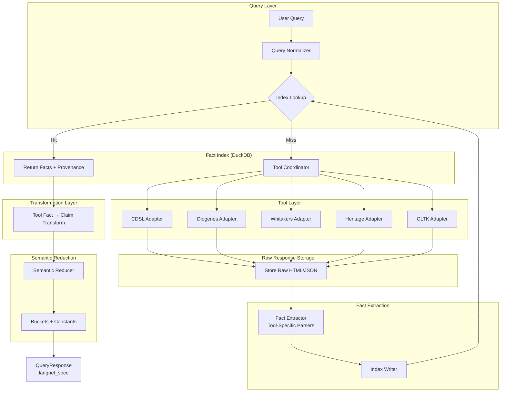
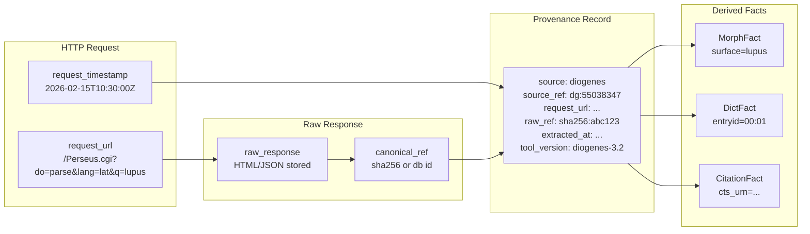
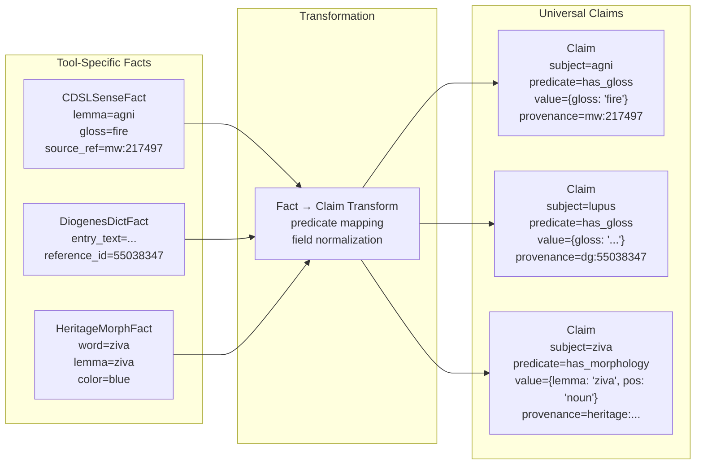
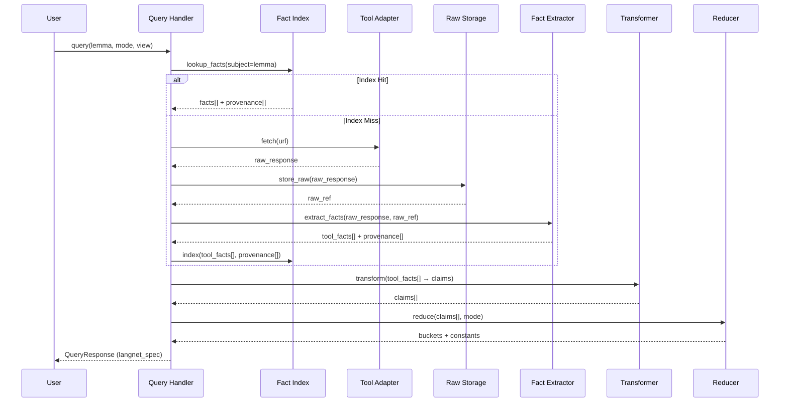

# Tool Fact Architecture: Two-Layer Proto Design

**Status**: Draft - See `tool-response-pipeline.md` for refined pipeline
**Date**: 2026-02-15
**Priority**: HIGH (Foundational architecture)
**Related**: `tool-response-pipeline.md` (5-stage pipeline), `classifier-and-reducer.md`, `tool-capabilities.md`

## Note

This document defines fact types and the transformation layer. The **pipeline architecture** has been refined in `tool-response-pipeline.md` to include explicit stages:

```
Tool Call → Raw Response → Extractions → Derivations → Claims
```

The fact types defined here (CDSLSenseFact, DiogenesMorphFact, etc.) are **Derivations** in the refined pipeline. The transformation rules remain valid.

## Executive Summary

This document defines a two-layer protobuf architecture for tool fact extraction and indexing:

1. **Tool-Specific Specs** - Each tool emits its own canonical fact types with tool-native fields
2. **Universal Layer (langnet_spec)** - The reduction/aggregation layer that normalizes tool outputs

This separation enables:
- Tools to evolve independently
- Tool-specific metadata preservation for provenance
- Clean transformation rules between layers
- Full provenance chains from URL to derived facts

## Design Principles

### 1. One Raw Response → Many Derived Facts

A single HTTP request to a tool produces one raw response (HTML/JSON) that can be parsed into multiple facts. The raw response is stored with a canonical `ref`, enabling:

- Parser iteration without re-fetching
- Re-extraction when parsing logic improves
- Debugging of fact derivation

### 2. Request-Level Provenance

Provenance is attached at the request level, not per-fact:

```
URL: /Perseus.cgi?do=parse&lang=lat&q=lupus
      ↓
Raw Response (stored)
      ↓
Fact Extraction
      ↓
Many Facts (all share provenance pointing to URL + raw response)
```

Individual facts can have additional `source_ref` context (e.g., `mw:217497`, `dg:55038347`).

### 3. Lazy Indexing

Index is built on first query, cached until explicit refresh:

- **No upfront cost** - Only indexes what's actually queried
- **`--refresh` flag** - Force re-fetch and re-index
- **Optional pre-build** - `just index-warm` for hot lemmas

### 4. Tool-Specific Fields Stay in Tool Specs

Tool-native fields are not promoted to the universal layer:

| Tool | Tool-Specific Fields |
|------|---------------------|
| Heritage | `color`, `color_meaning`, `compound_role`, `sandhi` |
| Diogenes | `reference_id`, `logeion_link`, `is_fuzzy_match`, `entry_id` |
| CDSL | `sense_lines`, `grammar_refs` |
| Whitakers | `term_codes`, `term_facts` |

Only cross-language pedagogical metadata (like `foster_codes`) is promoted to universal.

## Architecture Overview



## Tool Fact Types

### CDSL (Monier-Williams, Apte)

| Fact Type | Fields | Provenance |
|-----------|--------|------------|
| `CDSLSenseFact` | lemma, gloss, pos, gender, root, domains, register, sense_lines | source_ref (e.g., `mw:217497`) |
| `CDSLEntryFact` | headword, pos, gender, etymology, grammar_refs | entry_id |

**Tool-specific**: `sense_lines` (raw unparsed), `grammar_refs` (Uṇ., RV., etc.)

### Diogenes

| Fact Type | Fields | Provenance |
|-----------|--------|------------|
| `DiogenesMorphFact` | surface, lemmas[], tags[], defs[] | reference_id, logeion_link |
| `DiogenesDictFact` | entry_id, entry_text, term, citations{} | reference_id |
| `DiogenesCitationFact` | cts_urn, text, author, work | entry_id |

**Tool-specific**: `reference_id` (Diogenes internal ID), `logeion_link`, `is_fuzzy_match`, `entry_id` (hierarchical like `00:01:02`)

### Heritage Platform

| Fact Type | Fields | Provenance |
|-----------|--------|------------|
| `HeritageMorphFact` | word, lemma, root, pos, stem, features | analysis_id |
| `HeritageDictFact` | headword, lemma, definitions[], pos, gender | dictionary_url |
| `HeritageColorFact` | word, color, color_meaning | analysis_id |

**Tool-specific**: `color`, `color_meaning`, `compound_role`, `sandhi`

### Whitaker's Words

| Fact Type | Fields | Provenance |
|-----------|--------|------------|
| `WhitakersAnalysisFact` | surface, lemma, pos, features{}, senses[] | analysis_hash |
| `WhitakersTermFact` | term, codes[], parsed_facts | term_line |

**Tool-specific**: `term_codes`, `term_facts` (internal parsing artifacts)

### CLTK

| Fact Type | Fields | Provenance |
|-----------|--------|------------|
| `CLTKMorphFact` | surface, lemma, pos, features{} | model_id |
| `CLTKLewisFact` | headword, principal_parts[], root, senses[] | entry_ref |

**Tool-specific**: `principal_parts` (Lewis & Short specific), `model_id`

## Provenance Chain



### Provenance Schema

```protobuf
message ProvenanceRecord {
  string provenance_id = 1;           // UUID
  string source = 2;                  // cdsl, diogenes, heritage, whitakers, cltk
  string source_ref = 3;              // Tool-specific: mw:217497, dg:55038347
  string request_url = 4;             // Full URL that produced the response
  string raw_ref = 5;                 // Reference to stored raw response (sha256 or db id)
  google.protobuf.Timestamp extracted_at = 6;
  string tool_version = 7;            // Version of the tool/adapter
  map<string, string> metadata = 8;   // Additional context (is_fuzzy, encoding, etc.)
}
```

## Index Schema (DuckDB)

### Table: `raw_responses`

| Column | Type | Description |
|--------|------|-------------|
| `raw_ref` | VARCHAR (PK) | SHA256 hash or UUID |
| `source` | VARCHAR | Tool name |
| `request_url` | VARCHAR | Full URL |
| `response_data` | BLOB | Compressed HTML/JSON |
| `fetched_at` | TIMESTAMP | When response was fetched |
| `response_hash` | VARCHAR | For deduplication |

### Table: `tool_facts`

| Column | Type | Description |
|--------|------|-------------|
| `fact_id` | VARCHAR (PK) | UUID |
| `tool` | VARCHAR | Tool name |
| `fact_type` | VARCHAR | SenseFact, MorphFact, etc. |
| `subject` | VARCHAR | Lemma or surface form |
| `predicate` | VARCHAR | has_gloss, has_morphology, has_citation |
| `fact_data` | BLOB | Serialized protobuf |
| `provenance_id` | VARCHAR (FK) | Link to provenance |

### Table: `provenance_records`

| Column | Type | Description |
|--------|------|-------------|
| `provenance_id` | VARCHAR (PK) | UUID |
| `source` | VARCHAR | Tool name |
| `source_ref` | VARCHAR | Tool-specific reference |
| `request_url` | VARCHAR | Original request URL |
| `raw_ref` | VARCHAR (FK) | Link to raw response |
| `extracted_at` | TIMESTAMP | Extraction timestamp |
| `tool_version` | VARCHAR | Adapter version |
| `metadata` | JSON | Additional context |

### Table: `fact_index`

| Column | Type | Description |
|--------|------|-------------|
| `subject` | VARCHAR (PK) | Lemma or surface |
| `predicate` | VARCHAR (PK) | has_gloss, has_morphology, etc. |
| `tool` | VARCHAR (PK) | Tool name |
| `fact_id` | VARCHAR (FK) | Link to fact |
| `provenance_id` | VARCHAR (FK) | Link to provenance |

### Table: `index_metadata`

| Column | Type | Description |
|--------|------|-------------|
| `tool` | VARCHAR (PK) | Tool name |
| `last_built` | TIMESTAMP | Last index build time |
| `fact_count` | INTEGER | Number of facts indexed |
| `tool_version` | VARCHAR | Version at build time |
| `build_duration_ms` | INTEGER | Build time |

## Transformation Layer

Tool-specific facts are transformed into universal Claims:



### Transformation Rules

| Tool Fact Type | Universal Predicate | Value Mapping |
|----------------|---------------------|---------------|
| `CDSLSenseFact` | `has_gloss` | `{gloss, domains, register}` |
| `DiogenesDictFact` | `has_gloss` | `{gloss, sense_id}` |
| `DiogenesCitationFact` | `has_citation` | `{cts_urn, text, author, work}` |
| `HeritageMorphFact` | `has_morphology` | `{lemma, pos, features}` |
| `WhitakersAnalysisFact` | `has_morphology` | `{lemma, pos, features}` |

Tool-specific fields (color, reference_id, etc.) are preserved in the original fact but not promoted to claims.

## Query Flow



## Proto File Structure

```
vendor/langnet-spec/schema/
├── langnet_spec.proto          # Universal layer (exists)
├── provenance.proto            # NEW: Shared provenance types
└── tools/
    ├── cdsl_spec.proto         # NEW: CDSL facts
    ├── diogenes_spec.proto     # NEW: Diogenes facts
    ├── heritage_spec.proto     # NEW: Heritage facts
    ├── whitakers_spec.proto    # NEW: Whitakers facts
    └── cltk_spec.proto         # NEW: CLTK facts
```

## Configuration Options

### Raw Response Storage

| Environment | Default | Rationale |
|-------------|---------|-----------|
| Development | `true` | Enable parser iteration |
| Production | `false` (configurable) | Storage optimization |

Set via `LANGNET_STORE_RAW_RESPONSES=true|false`

### Index Refresh

| Method | Command | Use Case |
|--------|---------|----------|
| Lazy (default) | N/A | First query builds index |
| Force refresh | `--refresh` | Stale data, tool updates |
| Pre-build | `just index-warm <lemma-list>` | Hot lemmas, offline prep |

## Completion Criteria

- [ ] Proto files created for all tools
- [ ] Provenance types defined in `provenance.proto`
- [ ] FactIndexer implemented with DuckDB schema
- [ ] Raw response storage implemented
- [ ] Adapters updated to emit tool facts
- [ ] Transformation layer implemented
- [ ] Query flow wired (index-first)
- [ ] Tests: fact extraction, indexing, transformation

## Related Documents

- `docs/technical/design/mermaid/tool-fact-flow.md` - Detailed mermaid diagrams
- `docs/plans/active/tool-fact-indexing.md` - Implementation roadmap
- `docs/technical/backend/tool-capabilities.md` - Per-tool fact expectations
- `docs/technical/design/classifier-and-reducer.md` - Downstream consumer
