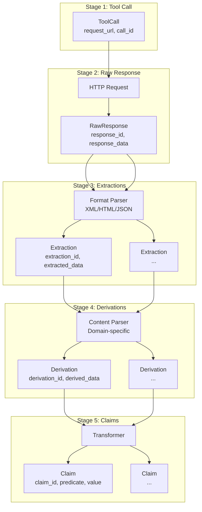

# Tool Response Pipeline: Raw → Extract → Derive

**Status**: Draft
**Date**: 2026-02-15
**Priority**: FOUNDATIONAL
**Related**: `query-planning.md` (Stage -1 and 0), `tool-fact-architecture.md` (Fact types)

## Executive Summary

This document defines the pipeline stages after query planning:

```
Tool Call → Tool Response (raw) → Extractions → Derivations → Claims
```

For the stages before tool calls (query normalization, planning, plan execution), see `query-planning.md`.

## Complete Pipeline (All Stages)

```
Stage -1: User Input         "shiva", "lupus", "λόγος"
Stage  0: Query Planning     → NormalizedQuery → ToolPlan
Stage  0.5: Plan Execution   → Execute ToolPlan
Stage  1: Tool Calls         → HTTP requests
Stage  2: Raw Responses      → Store HTML/XML/JSON
Stage  3: Extractions        → Format parsing
Stage  4: Derivations        → Content parsing → Tool-specific facts
Stage  5: Claims             → Universal layer → Semantic reduction
```

See `query-planning.md` for Stages -1, 0, and 0.5. This document covers Stages 1-5.

## The Problem with Current Architecture

Current adapters conflate multiple stages:

```python
# Current: extraction + derivation happen together
def handle_query(self, word):
    raw = self.fetch(word)           # HTTP call
    entry = self._parse_raw(raw)     # Extraction (format parsing)
    facts = self._extract_facts(entry)  # Derivation (content parsing)
    return DictionaryEntry(          # Mixed output
        definitions=facts,           # Derivations
        metadata={"raw": entry}      # Extraction (hidden in metadata)
    )
```

**Problems**:
1. Raw response is discarded (can't re-parse with improved parsers)
2. Extraction vs derivation is conflated (can't re-derive without re-extracting)
3. Provenance chain is incomplete (can't trace back to "which sense line produced this gloss?")
4. No clear contract for each stage

## The Four-Stage Pipeline

### Stage 1: Tool Call

The HTTP request to a tool/backend.

```python
@dataclass
class ToolCall:
    tool: str                    # "diogenes", "cdsl", "heritage"
    request_url: str             # Full URL with query params
    request_params: dict         # Parsed parameters
    called_at: datetime
    call_id: str                 # UUID for this call
```

**Stored**: Index of all tool calls (for analytics, debugging)

### Stage 2: Tool Response (Raw)

The raw HTTP response, stored exactly as received.

```python
@dataclass
class RawResponse:
    response_id: str             # UUID (different from call_id if retries)
    call_id: str                 # Links back to ToolCall
    tool: str
    request_url: str
    response_data: bytes         # Compressed HTML/XML/JSON
    content_type: str            # "text/html", "application/xml"
    status_code: int
    fetched_at: datetime
    response_hash: str           # SHA256 for deduplication
```

**Stored**: `raw_responses` table in DuckDB

**Key insight**: Raw responses are immutable. They can be re-parsed indefinitely.

### Stage 3: Extractions

Parsing the raw response format to extract structured chunks.

This is **format parsing**, not content interpretation:

- XML parsing: `<entry id="217497">...</entry>` → dict with id and content
- HTML parsing: `<div class="sense">...</div>` → text content
- JSON parsing: API response → structured dict

```python
@dataclass
class Extraction:
    extraction_id: str           # UUID
    response_id: str             # Links to RawResponse
    tool: str
    extraction_type: str         # "xml_entry", "html_block", "json_object"
    extraction_path: str         # XPath, CSS selector, or JSON path
    extracted_data: dict         # Structured chunk (not yet interpreted)
    extraction_metadata: dict    # Parser version, timing
    extracted_at: datetime
```

**Example extractions**:

| Tool | Raw Format | Extraction |
|------|-----------|------------|
| CDSL/MW | XML | `<entry>` blocks with `@id` |
| Diogenes | HTML | `<div id="sense">` blocks |
| Heritage | JSON | `analyses[]` arrays |
| Whitakers | Text | Lines matching patterns |

**Stored**: `extractions` table in DuckDB

**Key insight**: Extractions are tied to a specific parser version. Re-running with a new parser produces new extractions from the same raw response.

### Stage 4: Derivations

Interpreting extracted chunks to produce domain-specific facts.

This is **content parsing**, applying domain knowledge:

- Parse `<sense>` content to extract gloss, domains, register
- Parse morphology tags to extract case, number, gender
- Parse citation references to extract CTS URNs

```python
@dataclass
class Derivation:
    derivation_id: str           # UUID
    extraction_id: str           # Links to Extraction
    tool: str
    derivation_type: str         # "sense_fact", "morph_fact", "citation_fact"
    derived_data: dict           # Tool-specific fact (see proto schemas)
    derivation_metadata: dict    # Parser version, confidence
    derived_at: datetime
```

**Example derivations**:

| Extraction | Derivation |
|------------|------------|
| `<entry id="217497">agni...m. fire...</entry>` | `CDSLSenseFact(lemma="agni", gloss="fire", pos="m.")` |
| `<div id="sense">I. wolf...</div>` | `DiogenesDictFact(entry_id="00", entry_text="I. wolf...")` |
| `{case: "nom", number: "sg"}` | `MorphFact(case="nominative", number="singular")` |

**Stored**: `derivations` table in DuckDB

**Key insight**: Derivations are tool-specific. Each tool defines its own derivation types (see `tools/*_spec.proto`).

### Stage 5: Claims (Universal Layer)

Derivations are transformed to universal Claims for the semantic reducer:

```python
@dataclass
class Claim:
    claim_id: str
    derivation_id: str           # Links to Derivation
    subject: str                 # lemma or surface form
    predicate: str               # has_gloss, has_morphology, has_citation
    value: dict                  # Normalized value
    provenance_chain: ProvenanceChain
```

The `ProvenanceChain` links all the way back:

```python
@dataclass
class ProvenanceChain:
    call_id: str                 # Which tool call
    response_id: str             # Which raw response
    extraction_id: str           # Which extraction
    derivation_id: str           # Which derivation
    tool: str
    source_ref: str              # Tool-specific ref (e.g., "mw:217497")
```

## Complete Pipeline Diagram



## Storage Schema

```sql
-- Stage 1: Tool Calls
CREATE TABLE tool_calls (
    call_id VARCHAR PRIMARY KEY,
    tool VARCHAR NOT NULL,
    request_url VARCHAR NOT NULL,
    request_params JSON,
    called_at TIMESTAMP
);

-- Stage 2: Raw Responses
CREATE TABLE raw_responses (
    response_id VARCHAR PRIMARY KEY,
    call_id VARCHAR,
    tool VARCHAR NOT NULL,
    request_url VARCHAR NOT NULL,
    response_data BLOB,
    content_type VARCHAR,
    status_code INTEGER,
    fetched_at TIMESTAMP,
    response_hash VARCHAR
);

-- Stage 3: Extractions
CREATE TABLE extractions (
    extraction_id VARCHAR PRIMARY KEY,
    response_id VARCHAR NOT NULL,
    tool VARCHAR NOT NULL,
    extraction_type VARCHAR NOT NULL,
    extraction_path VARCHAR,
    extracted_data JSON,
    extraction_metadata JSON,
    extracted_at TIMESTAMP
);

-- Stage 4: Derivations
CREATE TABLE derivations (
    derivation_id VARCHAR PRIMARY KEY,
    extraction_id VARCHAR NOT NULL,
    tool VARCHAR NOT NULL,
    derivation_type VARCHAR NOT NULL,
    derived_data BLOB,           -- Serialized proto
    derivation_metadata JSON,
    derived_at TIMESTAMP
);

-- Stage 5: Claims (Universal)
CREATE TABLE claims (
    claim_id VARCHAR PRIMARY KEY,
    derivation_id VARCHAR NOT NULL,
    subject VARCHAR NOT NULL,
    predicate VARCHAR NOT NULL,
    value JSON,
    provenance_chain JSON
);

-- Indexes for common lookups
CREATE INDEX idx_raw_responses_call ON raw_responses(call_id);
CREATE INDEX idx_extractions_response ON extractions(response_id);
CREATE INDEX idx_derivations_extraction ON derivations(extraction_id);
CREATE INDEX idx_claims_subject ON claims(subject);
CREATE INDEX idx_claims_predicate ON claims(predicate);
```

## Tool-Specific Examples

### CDSL (Monier-Williams)

```
Tool Call:
  request_url: http://localhost:48080/sktreader?q=agni
  call_id: uuid-001

Raw Response:
  response_id: uuid-002
  response_data: <xml><entry id="217497"><h>agni</h>...</entry></xml>
  content_type: application/xml

Extraction (XML Parser):
  extraction_id: uuid-003
  extraction_type: "xml_entry"
  extracted_data: {
    "entry_id": "217497",
    "headword": "agni",
    "sense_lines": ["m. fire, sacrificial fire...", ...]
  }

Derivation (CDSL Content Parser):
  derivation_id: uuid-004
  derivation_type: "CDSLSenseFact"
  derived_data: {
    "lemma": "agni",
    "gloss": "fire, sacrificial fire",
    "pos": "noun",
    "gender": "masculine",
    "domains": ["religion", "ritual"],
    "source_ref": "mw:217497"
  }

Claim (Transformed):
  claim_id: uuid-005
  subject: "agni"
  predicate: "has_gloss"
  value: {"gloss": "fire, sacrificial fire", "domains": ["religion", "ritual"]}
  provenance_chain: {
    call_id: "uuid-001",
    response_id: "uuid-002",
    extraction_id: "uuid-003",
    derivation_id: "uuid-004",
    source_ref: "mw:217497"
  }
```

### Diogenes

```
Tool Call:
  request_url: http://localhost:8888/Perseus.cgi?do=parse&lang=lat&q=lupus
  call_id: uuid-100

Raw Response:
  response_id: uuid-101
  response_data: <html><div id="sense">I. wolf...</div>...</html>
  content_type: text/html

Extraction (HTML Parser):
  extraction_id: uuid-102
  extraction_type: "html_block"
  extraction_path: "#sense"
  extracted_data: {
    "block_id": "00",
    "content": "I. Lit.: torva leaena lupum sequitur...",
    "citations": {"urn:cts:...": "Verg. E. 2, 63"}
  }

Derivation (Diogenes Content Parser):
  derivation_id: uuid-103
  derivation_type: "DiogenesDictFact"
  derived_data: {
    "entry_id": "00",
    "entry_text": "I. Lit.: torva leaena lupum sequitur...",
    "term": "lupus",
    "reference_id": "55038347"
  }

Derivation (Citation Parser):
  derivation_id: uuid-104
  derivation_type: "DiogenesCitationFact"
  derived_data: {
    "cts_urn": "urn:cts:latinLit:phi0119.phi008",
    "text": "torva leaena lupum sequitur",
    "author": "Vergil",
    "work": "Eclogues"
  }
```

## Re-Parsing Benefits

With this architecture, each stage can be re-run independently:

### Scenario 1: Improved Format Parser

"We found a bug in the XML parser that missed some entries."

```
Raw Response (unchanged) → New Extraction (fixed parser) → Derivations (re-run) → Claims (re-run)
```

Cost: Only re-parse format, don't re-fetch from tool.

### Scenario 2: Improved Content Parser

"We want to extract domains from sense text that we previously ignored."

```
Extraction (unchanged) → New Derivation (enhanced parser) → Claims (re-run)
```

Cost: Only re-parse content, don't re-extract format.

### Scenario 3: Improved Transformation

"We want to promote `foster_codes` to the universal layer."

```
Derivation (unchanged) → New Claim (updated transform)
```

Cost: Only re-transform, don't re-parse anything.

## V1 vs V2 Decision

### V1 (Shim Current Architecture)

Pros:
- Incremental migration
- Existing tests still work
- Faster to initial value

Cons:
- Provenance chain incomplete
- Mixed concerns persist
- Technical debt compounds

### V2 (Clean Slate)

Pros:
- Clear contracts per stage
- Full provenance chain
- Each stage independently testable
- Re-parsing enables iteration

Cons:
- Larger upfront effort
- Existing adapters need rewrite
- Migration path for users

**Recommendation**: Start V2 as parallel implementation. Run both pipelines side-by-side until V2 is proven, then deprecate V1.

## Implementation Phases

### Phase 1: Define Proto Schemas (1-2 days)

Create proto files for each stage:

- `tool_call.proto` - ToolCall, RequestParams
- `raw_response.proto` - RawResponse, ResponseMetadata
- `extraction.proto` - Extraction, ExtractionMetadata
- `tools/*_spec.proto` - Tool-specific derivations
- `claim.proto` - Claim, ProvenanceChain

### Phase 2: Implement Storage Layer (2-3 days)

- DuckDB schema for all 5 stages
- Compression for raw responses
- Indexes for common queries
- Migration utilities

### Phase 3: Build Pipeline Runner (3-4 days)

- `PipelineRunner` class that orchestrates all stages
- Stage interfaces (extractors, derivators, transformers)
- Error handling and retries
- Progress tracking

### Phase 4: Implement Per-Tool Extractors (2-3 days per tool)

- CDSL XML extractor
- Diogenes HTML extractor
- Heritage JSON extractor
- Whitakers text extractor
- CLTK adapter

### Phase 5: Implement Per-Tool Derivators (3-4 days per tool)

- CDSL sense/entry derivator
- Diogenes dict/citation derivator
- Heritage morphology derivator
- Whitakers analysis derivator

### Phase 6: Build V2 API/CLI (2-3 days)

- New endpoints that use V2 pipeline
- Side-by-side with V1
- Feature flag for gradual rollout

## Related Documents

- `docs/technical/design/tool-fact-architecture.md` - Earlier version (may be superseded)
- `docs/technical/design/entry-parsing.md` - Derivation stage design
- `docs/technical/backend/tool-capabilities.md` - Per-tool expectations
