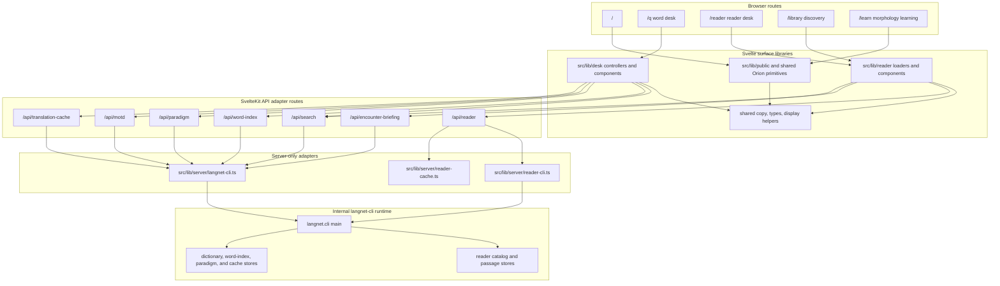
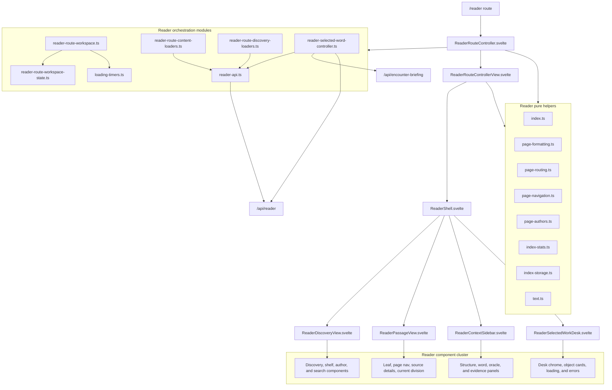
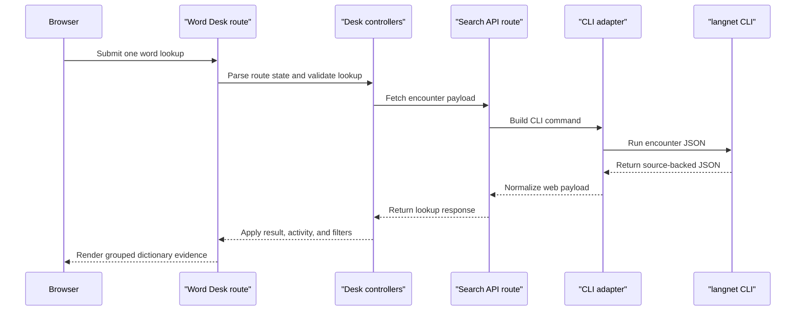
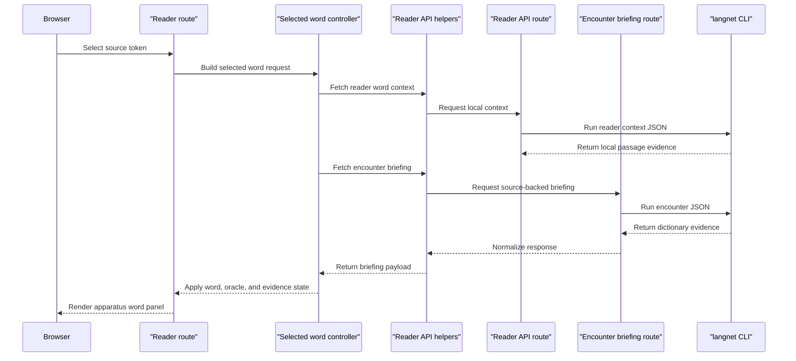

# Frontend Architecture

Project Orion is the public SvelteKit frontend for the internal `langnet-cli`
runtime. The web app is intentionally thin at the backend boundary: browser
routes own URL state and interaction state, SvelteKit API routes adapt requests
to CLI JSON commands, and reusable surface modules under `webapp/src/lib/`
handle transformation, orchestration, and rendering.

## Route And Data Boundary

## Word Desk Surface

The `/q` route composes one route controller and many extracted modules. The
remaining route-owned work should stay limited to Svelte state assignment,
URL synchronization, and top-level request sequencing.

```mermaid
flowchart TB
    DeskRoute["/q route"] --> DeskController["DeskRouteController.svelte"]
    DeskController --> DeskShell["DeskPageShell.svelte"]
    DeskController --> DeskTopbar["DeskTopbar.svelte"]
    DeskController --> DeskHero["DeskHeroSearch.svelte"]
    DeskController --> DeskResults["DeskLookupResults.svelte"]
    DeskController --> DeskSidebar["DeskSidebar.svelte"]

    subgraph DeskControllers["Desk orchestration modules"]
        RouteState["desk-route.ts"]
        StorageController["desk-route-storage-controller.ts"]
        Workflows["desk-workflows.ts"]
        Activity["desk-activity.ts"]
        MotdController["desk-motd-controller.ts"]
        ParadigmController["desk-paradigm-controller.ts"]
        WordIndex["desk-word-index.ts"]
        ToolFilters["desk-tool-filters.ts"]
        ViewState["desk-view-state.ts"]
    end

    subgraph DeskPureHelpers["Desk pure helpers"]
        Lookup["desk-lookup.ts"]
        Entry["desk-entry.ts"]
        Status["desk-status.ts"]
        Session["desk-session.ts"]
        Motd["desk-motd.ts"]
        Paradigm["desk-paradigm.ts"]
        Endpoints["desk-endpoints.ts"]
        Oracle["desk-oracle.ts"]
    end

    subgraph DeskComponents["Desk component cluster"]
        ResultsCard["DeskDictionaryGroupCard.svelte"]
        ComponentLedger["DeskComponentLedger.svelte"]
        WordIndexRail["DeskWordIndexRail.svelte"]
        MotdFolio["DeskMotdFolio.svelte"]
        ActivityLedger["DeskActivityLedger.svelte"]
        ParadigmPanel["DeskParadigmPanel.svelte"]
        OracleTrace["DeskOracleTrace.svelte"]
    end

    DeskController --> RouteState
    DeskController --> StorageController
    DeskController --> Workflows
    DeskController --> Activity
    DeskController --> MotdController
    DeskController --> ParadigmController
    DeskController --> WordIndex
    DeskController --> ToolFilters
    DeskController --> ViewState
    DeskController --> DeskPureHelpers
    DeskResults --> DeskComponents
    DeskSidebar --> DeskComponents

    RouteState --> Endpoints
    Workflows --> Lookup
    Workflows --> Endpoints
    WordIndex --> Endpoints
    StorageController --> Session
    ResultsCard --> Entry
    ResultsCard --> Status
    OracleTrace --> Oracle
```

## Reader Surface

The Reader has already moved most rendering and route IO into a vertical
`src/lib/reader/` cluster. The next quality target is continued reduction of
route-owned orchestration in `ReaderRouteController.svelte`.

## Lookup Request Flow

## Reader Selected Word Flow

## Maintenance Rules

- Keep route files as orchestration boundaries. Components render, helpers
  transform, controllers coordinate side effects, and API routes adapt to CLI
  contracts.
- Add new Word Desk code under `webapp/src/lib/desk/` once it is not route-only
  state.
- Add new Reader code under `webapp/src/lib/reader/` unless it is a shared Orion
  primitive.
- Keep SvelteKit API routes thin. They should validate request parameters,
  invoke server-only adapters, and normalize output for the browser.
- Keep public docs and UI copy on the Project Orion name. Use `langnet-cli` only
  for internal runtime and developer-facing boundaries.
