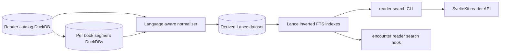
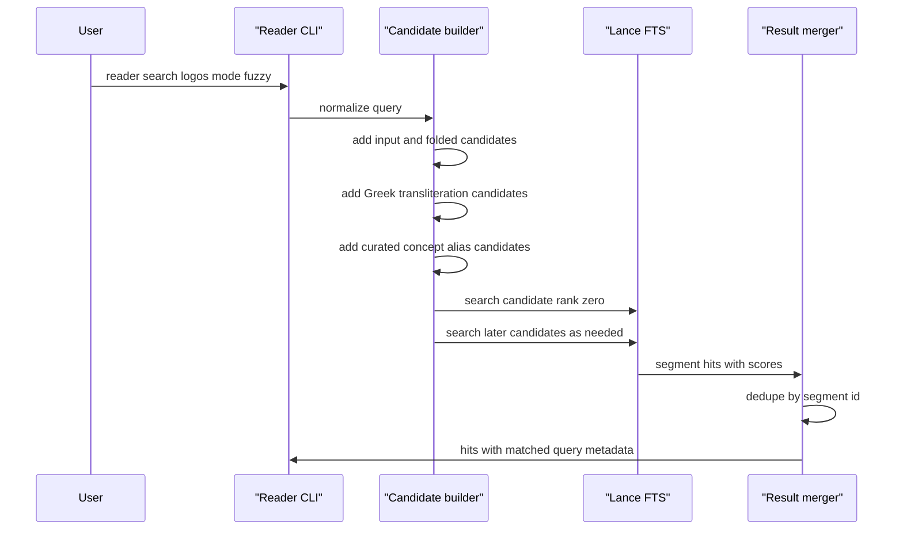
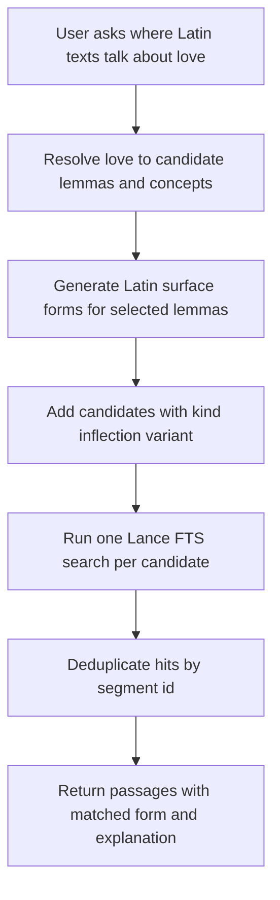

# Reader Full Text Search

This document describes the current reader full text search system: what is
indexed, how the derived Lance dataset is built, how queries are normalized and
expanded, and where the morphology and concept-search boundary currently sits.

The search index is a rebuildable cache over the reader corpus. The canonical
reader data remains the catalog DuckDB plus per-book DuckDB segment artifacts.
Search rows are derived from those stores and written to a Lance dataset through
DuckDB's `lance` extension.

## The Big Lance File

`data/build/reader/search.lance` is the large derived full-text search artifact
for the reader corpus. It is a directory-backed Lance dataset, not a single
SQLite-style database file. It contains one row per indexed reader segment plus
Lance inverted indexes that make `reader search` fast enough across the full
local corpus.

It contains:

- segment identity and location fields, such as `artifact_id`, `segment_id`,
  `work_id`, `citation_path`, and `sort_key`
- work metadata needed in search results, such as language, collection, title,
  author, canonical author, CTS URN, and canonical text id
- display text for rendering hits
- normalized searchable text fields for Latin, Greek, Sanskrit, and fallback
  language behavior
- discovery fields used by group and tag filters
- build metadata, including index schema version, normalizer version, build
  timestamp, and source artifact hash
- Lance FTS indexes over `search_text`, `search_text_folded`, and `token_text`

It powers:

- `just cli reader search ...`
- `/api/reader?mode=search` through the SvelteKit reader adapter
- optional inline corpus examples in `just cli encounter ... --reader-search-index`
- fuzzy search candidate expansion, including Greek ASCII transliteration and
  curated concept aliases

It does not contain the canonical reader corpus. The canonical local reader data
for this layer is still:

- `data/build/reader/catalog.duckdb`
- `data/build/reader/books/`
- tracked curated metadata under `data/curated/`
- generated-but-reviewed restoration inputs under `data/generated/`

Because `search.lance` is derived from those sources, it is safe to delete when
disk is tight as long as the catalog and book artifacts remain available. The
cost is rebuild time, not source-data loss.

## Runtime Shape



Current implementation entry points:

- Build and query code: `src/langnet/reader/search_index.py`
- Text normalization: `src/langnet/reader/search_normalization.py`
- Reader service payloads: `src/langnet/reader/service.py`
- CLI commands: `src/langnet/cli.py`
- Curated concept aliases: `data/curated/reader_search/`
- Tests: `tests/test_reader_search_index.py` and reader/encounter CLI tests

## Build Lifecycle

Build a new search index after rebuilding the reader catalog:

```bash
export CATALOG=data/build/reader/catalog.duckdb
export SEARCH_INDEX=data/build/reader/search.lance

just cli reader --catalog $CATALOG search-index build \
  --index $SEARCH_INDEX \
  --replace \
  --output json

just cli reader --catalog $CATALOG search-index validate \
  --index $SEARCH_INDEX \
  --output json
```

Use `--replace` for the normal "make me a new one" workflow. It removes the old
Lance dataset at that path and writes a fresh dataset from the current catalog
and book artifacts.

For a scoped debug build, add `--language lat`, `--language grc`,
`--language san`, or `--collection <collection_id>`. The `--limit` option is
for small local debugging only.

The build process:

1. Opens the reader catalog DuckDB and selects artifact rows from `artifacts`,
   `works`, and optional `work_classifications`.
2. Opens each per-book DuckDB artifact and reads rows from `segments`.
3. Normalizes each segment into display and search fields.
4. Writes rows in batches to a `.lance` dataset.
5. Creates Lance inverted indexes over the searchable text fields.

The builder appends when `--replace` is not supplied. This is useful for
language-sliced builds, but normal operational rebuilds should use `--replace`
to avoid stale rows from an older catalog.

DuckDB loads the `lance` extension at runtime. In a fresh environment, DuckDB may
need the community extension available before build or search commands can run.

Create a new `search.lance` when:

- the reader catalog was rebuilt
- per-book segment artifacts under `data/build/reader/books/` changed
- curated discovery metadata changed and search filters should reflect it
- search normalization logic changed
- `SEARCH_INDEX_SCHEMA_VERSION` or `NORMALIZER_VERSION` changed
- the existing Lance dataset fails validation
- disk cleanup removed the old derived dataset
- you want a scoped experiment, such as a Greek-only index or a small `--limit`
  fixture

You do not need a new `search.lance` for ordinary lookup, reader display, or
metadata-only browsing that does not use full-text search.

## Disk Operations

The reader search index can be large. On the current research node, the derived
`data/build/reader/search.lance` artifact has been observed around 21G. Treat it
as rebuildable operational data, not source data.

Check footprint before and after full corpus builds:

```bash
du -sh data/build/reader/search.lance data/build/reader 2>/dev/null || true
df -h .
just cli reader --catalog data/build/reader/catalog.duckdb search-index status \
  --index data/build/reader/search.lance \
  --output json
```

Safe cleanup policy:

- `data/build/reader/search.lance` is derived and may be removed when disk is
  tight, then rebuilt from the reader catalog and book artifacts.
- `data/build/reader/catalog.duckdb` and `data/build/reader/books/` are the
  canonical local reader build outputs for this layer. Do not remove them when
  the goal is only to free search-index space.
- Prefer a normal `--replace` rebuild for search-index refreshes. It removes the
  existing Lance dataset before writing the replacement.
- Avoid repeated append-style language slice builds on the same path unless that
  is intentional. Appends can leave stale or duplicate operational data if the
  catalog changed.
- If multiple experimental indexes are needed, write them under
  `examples/debug/` or a clearly named path and delete the superseded datasets
  after validation.

To reclaim search-index space:

```bash
rm -rf data/build/reader/search.lance

just cli reader --catalog data/build/reader/catalog.duckdb search-index build \
  --index data/build/reader/search.lance \
  --replace \
  --output json

just cli reader --catalog data/build/reader/catalog.duckdb search-index validate \
  --index data/build/reader/search.lance \
  --output json
```

If the research node is short on root-disk space, set `LANGNET_DATA_DIR` before
building so `data/build` and `data/cache` live on a larger volume.

## Indexed Row Shape

Each Lance row represents one reader segment. The row keeps enough metadata to
render search hits without opening the catalog for every result:

- Identity: `search_id`, `artifact_id`, `segment_id`, `work_id`,
  `edition_id`, `collection_id`
- Work metadata: `language`, `title`, `author`, `canonical_author_id`,
  `canonical_author_name`, `cts_work_urn`, `canonical_text_id`
- Location: `citation_path`, `canonical_address`, `sort_key`
- Text: `display_text`, `source_text`, `normalized_text`, `search_text`,
  `search_text_folded`, `token_text`
- Discovery metadata: `classification_discovery_group_id`,
  `classification_discovery_tags`, popularity scores
- Build metadata: `index_schema_version`, `normalizer_version`, `indexed_at`,
  `source_artifact_hash`

The current schema version is `langnet.reader_search_index.v1`. The current
normalizer version is `reader-search-normalizer-v1`.

The build creates these Lance FTS indexes:

- `search_text_idx` on `search_text`
- `search_text_folded_idx` on `search_text_folded`
- `token_text_idx` on `token_text`

`display_text` is a searchable field in the code, but the maintained FTS indexes
are currently on the normalized fields above.

## Normalization

The normalizer preserves learner-facing text in `display_text` and creates
separate fields for retrieval.

Latin:

- Unicode NFKC normalization
- case folding
- punctuation converted to token boundaries
- folded search form strips accents and maps `j` to `i`, `v` to `u`
- fuzzy query variants include `i/j` and `u/v` spelling alternatives

Greek:

- Unicode NFKC normalization
- Greek compatibility normalization
- final sigma normalization to sigma
- folded search form strips accents and breathings
- fuzzy search can expand ASCII transliteration such as `logos` or `andra`
  into Greek folded search keys

Sanskrit:

- Unicode NFKC normalization
- folded search strips diacritics
- anusvara before consonants can fold toward nasal variants
- Devanagari input can produce IAST and folded variants when the optional
  transliteration dependency is available

Inspect normalization before debugging a search:

```bash
just cli reader --catalog $CATALOG search-index inspect-normalize \
  --language lat \
  "Julius vivit" \
  --output json
```

Inspect the actual query candidates:

```bash
just cli reader --catalog $CATALOG search-index inspect-query \
  --language grc \
  --mode fuzzy \
  "logos" \
  --output json
```

## Query Modes

`reader search` supports these modes:

- `keyword`: normalize the query and pass it to Lance FTS.
- `phrase`: quote the normalized query for phrase-style FTS.
- `exact`: currently uses the same quoted FTS query shape as `phrase`.
- `fuzzy`: build ranked query candidates, search each candidate in order, and
  deduplicate segment hits.

Default field selection is `auto`, which maps to `search_text_folded`. Other
field options are `display`, `search`, and `folded`.

Basic search:

```bash
just cli reader --catalog $CATALOG search "amor" \
  --index $SEARCH_INDEX \
  --language lat \
  --limit 20 \
  --context 1 \
  --output json
```

Filtered search:

```bash
just cli reader --catalog $CATALOG search "logos" \
  --index $SEARCH_INDEX \
  --language grc \
  --mode fuzzy \
  --author-id langnet:reader:author:grc:aristotle \
  --limit 20 \
  --output json
```

Supported filters are `language`, `collection`, `work-id`, `author-id`,
`group`, and `tag`. When filters are present, the search path asks Lance for
prefiltered results. If the filtered search returns no rows, it falls back to a
deeper unprefiltered search and applies the SQL filter afterward. This avoids
missing scoped hits for common terms that rank too deeply in the global result
set.

## Fuzzy Candidate Expansion



Fuzzy responses expose `request.query_candidates`. Each item matched through a
candidate includes:

- `matched_query`
- `input_query`
- `matched_field`
- `match_type`
- `candidate_rank`

Candidate kinds currently produced by the runtime:

- `input`
- `normalized_surface`
- `transliteration_expansion`
- `concept_alias`

The code also recognizes `inflection_variant` as a candidate priority, but the
current reader search runtime does not yet generate Latin, Greek, or Sanskrit
inflection inventories from a lemma.

## Concept Aliases

Curated concept aliases live in YAML files under `data/curated/reader_search/`.
They bridge a user-facing English or romanized idea to concrete source-language
surface queries.

Example: `data/curated/reader_search/greek/aristotle-natural-place.yaml` maps
labels such as `proper place`, `natural place`, and `oikeios topos` to Greek
queries such as `οἰκεῖος τόπος`, `οἰκεῖον τόπον`, and `οἰκείῳ τόπῳ`.

In fuzzy mode, if the normalized user query matches a concept label, the source
queries are added as candidate searches over `search_text_folded`. Hits retain
the concept metadata so the UI can explain why they appeared.

## The Love Search Example

A user request like "where do Latin texts talk about love" can mean several
different retrieval tasks:

- surface search for Latin words such as `amor`, `amo`, `amare`, or `caritas`
- phrase search for a known expression
- lemma search for every inflected form of a lemma such as `amo`
- concept search for passages about love even when no obvious word form appears

The current production search system is lexical full text search with
normalization, transliteration, and curated concept aliases. It is not yet a
general semantic search engine and it does not yet create all inflected forms of
Latin `amo` by itself.

If a caller already has an inflection list, it can implement lemma-style recall
today by issuing one fuzzy or keyword search per form against the same Lance
index, then merging and deduplicating results by `segment_id`. That would be N
Lance FTS searches, one for each generated surface form. A future integrated
implementation should add those forms to `request.query_candidates` with
`kind = "inflection_variant"`, so the behavior is inspectable in the same way as
Greek transliteration and curated concepts.

Proposed future flow:



That future path should reuse the current candidate contract rather than adding
a separate response shape.

## Encounter Integration

`encounter` can include reader-search actions and optional inline corpus hits.
Without an index path, it emits actions that a UI or caller can run:

```bash
just cli encounter lat amo all \
  --include-reader-search \
  --translation-mode off \
  --output json
```

With an index path, it can attach inline results:

```bash
just cli encounter lat amo all \
  --reader-search-index $SEARCH_INDEX \
  --reader-catalog $CATALOG \
  --reader-search-limit 5 \
  --reader-search-context 1 \
  --translation-mode off \
  --output json
```

`--reader-search-all-candidates` searches each encounter reader-search
candidate and deduplicates inline hits. This is the closest existing production
path to the "N searches, then merge results" model.

## Result Shape

Search results include:

- score and segment identity
- work metadata and language
- citation path and sort key
- display text as both `text` and `snippet`
- optional `context_before` and `context_after`
- a `target` block suitable for `reader show`
- candidate-match metadata in fuzzy or all-candidate encounter searches

Context windows prefer the canonical per-book artifact when it is available.
If that lookup cannot be resolved, the search layer falls back to neighboring
rows in the Lance dataset.

## Validation And Troubleshooting

Use these checks when search behavior looks wrong:

```bash
just cli reader --catalog $CATALOG search-index status \
  --index $SEARCH_INDEX \
  --output json

just cli reader --catalog $CATALOG search-index validate \
  --index $SEARCH_INDEX \
  --output json

just cli reader --catalog $CATALOG search-index inspect-query \
  --language lat \
  --mode fuzzy \
  "amor" \
  --output json
```

Validation checks that the dataset exists, schema and normalizer versions match,
the index was built from the requested catalog, and required Lance FTS indexes
are present.

Common failure modes:

- The search index was not rebuilt after a catalog rebuild.
- A scoped append build left stale rows from a previous slice.
- The query is a lemma or concept, but only surface forms are currently indexed.
- The language was omitted, so language-specific normalization or expansion did
  not run.
- The DuckDB Lance extension is unavailable in the current environment.

## Design Boundary

Current search is deliberately a derived lexical index. It is good for finding
surface text across large reader corpora with language-aware normalization and
explainable query expansion.

It is not currently:

- a token-level morphology index
- a lemma index
- a semantic vector index
- a replacement for dictionary lookup, paradigm generation, or encounter
  reduction

The next natural extension for morphology-aware search is to generate
candidate surface forms from source-backed paradigm data, mark them as
`inflection_variant`, run the same Lance FTS loop, and keep the current
candidate/result explanation contract.
